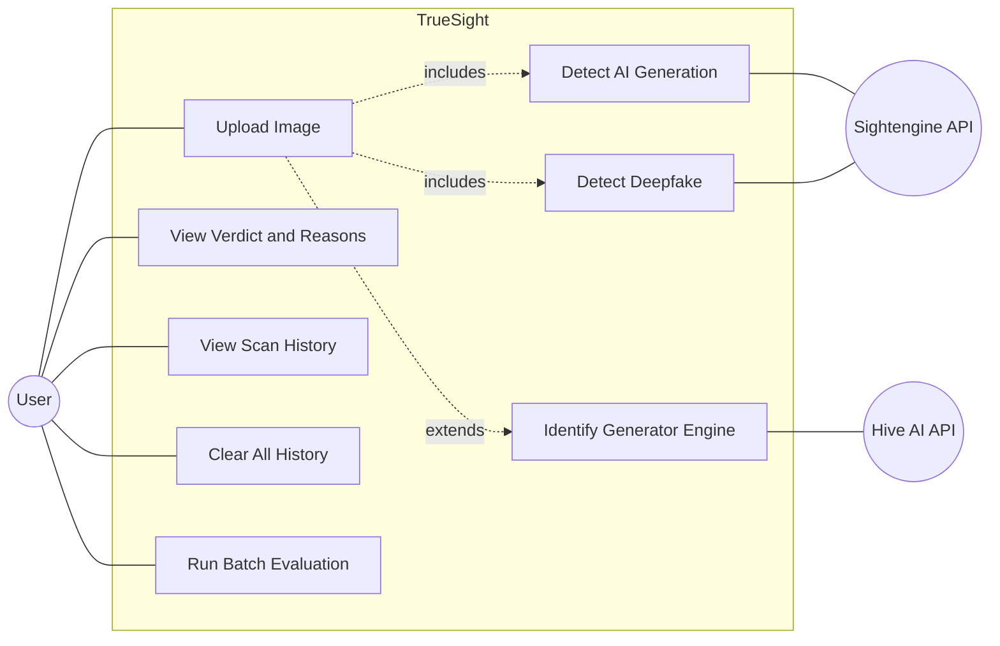
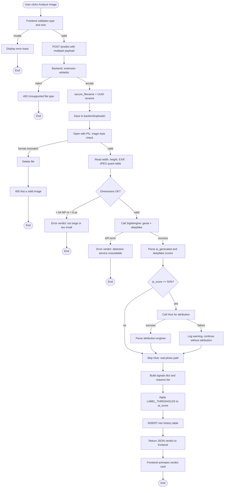
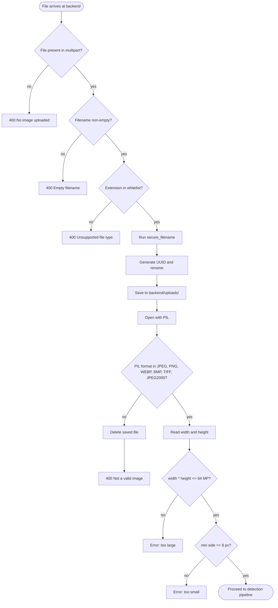

# 5. Analysis Phase

This chapter models the system's behaviour from a user-facing perspective. Use cases capture *what* the system does for whom; activity diagrams illustrate *how* the most complex behaviours unfold step by step.

## 5.1 Actors

Three actors participate in TrueSight's operations:

- **User** — a person who uploads an image and consumes the verdict. The user may be on the same physical machine as the backend or on any device connected to the same LAN.
- **Sightengine API** — an external system that classifies images for AI-generation likelihood and deepfake (face-swap) likelihood. Invoked once per scan.
- **Hive AI API** — an external system that classifies images and returns per-engine attribution among other things. Invoked only when Sightengine has judged the image AI.

## 5.2 Use Case Diagram

> **Export to PNG**: paste the following Mermaid code into https://mermaid.live → Actions → PNG.

The user has direct access to five use cases. Three of them — Detect AI Generation, Detect Deepfake, Identify Generator Engine — are not directly invoked by the user but are internal to the Upload-Image workflow, included or extended by it depending on the AI-or-real verdict. The "include" relationship (Upload → Detect AI Generation) is mandatory on every upload; the "extend" relationship (Upload → Identify Generator Engine) fires only when the image is judged AI.

## 5.3 Use Case Specifications

The five user-facing use cases are specified in detail below. Each specification follows the standard template — actor, preconditions, main flow, alternate flows, postconditions, exceptions.

### 5.3.1 UC-1 Upload Image

| Field | Content |
| --- | --- |
| **Actor** | User |
| **Goal** | Submit an image and receive a verdict describing whether it is AI-generated, with supporting forensic evidence. |
| **Preconditions** | The backend is running, the frontend is loaded, and the user has an image file no larger than 12 MB and no more than 64 megapixels in dimension. |
| **Main flow** | 1. User selects an image via file picker or drag-and-drop. 2. The frontend validates the file's MIME type and size client-side. 3. The user clicks **Analyze Image**. 4. The frontend POSTs the image to `/predict`. 5. The backend validates extension, renames to UUID, checks magic bytes, checks dimensions. 6. The backend calls Sightengine to obtain AI-generation and deepfake scores. 7. If AI-generation score ≥ 50%, the backend calls Hive for attribution. 8. The backend builds a verdict label, reasons list, and signals dictionary. 9. The backend persists the scan to history. 10. The backend returns the verdict to the frontend. 11. The frontend animates the verdict card and lists every signal and reason. |
| **Alternate flow A** | File rejected by frontend size or type check — the user sees an error toast and no upload occurs. |
| **Alternate flow B** | File rejected by backend validation — the user sees an inline error message in the verdict area. |
| **Alternate flow C** | Sightengine unreachable — the verdict returns "Error: Detection service unavailable" but no crash occurs. |
| **Alternate flow D** | Hive unreachable but Sightengine succeeded — the verdict displays Sightengine's results with a note that attribution was unavailable; no crash. |
| **Postconditions** | A new row is recorded in the `history` table with verdict, score, reasons, and timestamp; the image file is stored in `backend/uploads/` under its UUID name. |
| **Exceptions** | Network timeout on either API call → synthetic Error verdict returned to the user. |

### 5.3.2 UC-2 View Verdict and Reasons

| Field | Content |
| --- | --- |
| **Actor** | User |
| **Goal** | Understand why the system reached its verdict on a recently-uploaded image. |
| **Preconditions** | A scan has completed; the verdict card is visible. |
| **Main flow** | 1. User reads the verdict label (e.g. "AI Generated") and the confidence score. 2. User clicks **View Detection Details**. 3. A modal opens containing the bullet-point reasons list and the per-signal scores (Sightengine AI Classifier, Sightengine Deepfake, every Hive attribution row). 4. User reviews the EXIF camera and software fields where present. 5. User closes the modal. |
| **Postconditions** | None (read-only). |
| **Exceptions** | None. |

### 5.3.3 UC-3 View Scan History

| Field | Content |
| --- | --- |
| **Actor** | User |
| **Goal** | Review previously-analysed images. |
| **Preconditions** | At least one scan exists in the history table. |
| **Main flow** | 1. User clicks the **History** tab. 2. The frontend issues `GET /history`. 3. The backend returns the most recent 50 scans, newest first. 4. The frontend renders each scan as a card with thumbnail, verdict label, confidence score, and timestamp. |
| **Alternate flow A** | History is empty — the frontend displays an empty-state message. |
| **Alternate flow B** | Backend error reading the database — the endpoint returns an empty array (graceful degradation per NFR-10). |
| **Postconditions** | None (read-only). |
| **Exceptions** | None visible to the user. |

### 5.3.4 UC-4 Clear All History

| Field | Content |
| --- | --- |
| **Actor** | User |
| **Goal** | Permanently remove all stored scans and uploaded image files. |
| **Preconditions** | The history tab is active. |
| **Main flow** | 1. User clicks **Clear History**. 2. The frontend issues `DELETE /clear_history`. 3. The backend deletes every file under `backend/uploads/`. 4. The backend truncates the `history` table. 5. The frontend refreshes the history view to the empty state. |
| **Postconditions** | `history` table is empty; `uploads/` directory is empty. |
| **Exceptions** | Filesystem error during deletion → backend returns a 500 with the error message; user sees a toast. |

### 5.3.5 UC-5 Run Batch Evaluation

| Field | Content |
| --- | --- |
| **Actor** | User (developer / examiner) |
| **Goal** | Measure the detection pipeline's accuracy against a ground-truth-labelled test set. |
| **Preconditions** | API credentials are configured; `Test/README.md` contains ground-truth labels for at least one image. |
| **Main flow** | 1. User runs `backend/evaluate.py` from the command line. 2. The script parses `Test/README.md` for labelled rows. 3. The script loads any cached results from a previous `evaluation_results.json` and identifies images that need to be re-evaluated. 4. The script calls `predict_image()` for each new or previously-errored image. 5. The script computes the confusion matrix and metrics. 6. The script writes `evaluation_results.json` and `evaluation_report.md`. |
| **Alternate flow A** | Daily API quota exhausted partway through — remaining images record an Error result; metrics computed over the successful subset; a resume run completes the rest. |
| **Alternate flow B** | No ground-truth labels in `Test/README.md` — the script prints an error and exits. |
| **Postconditions** | Two report files are written at the project root; standard output displays a per-image table and a summary. |
| **Exceptions** | None blocking — every per-image failure is caught and recorded. |

## 5.4 Activity Diagrams

Two of the system's behaviours are complex enough to warrant their own activity diagram: the per-request `/predict` lifecycle (which includes the cascade decision and falls through several validation gates), and the layered input-validation stack itself.

### 5.4.1 Activity diagram: `/predict` request lifecycle

> **Export to PNG**: paste the following Mermaid code into https://mermaid.live → Actions → PNG.

The diamond at `ai_score >= 50%` is the central design decision of the project — it gates whether Hive is called. The two upstream diamonds (`format mismatch` and `dimensions OK`) close off the validation stack before any external API is contacted, ensuring the system spends no API quota on invalid input.

### 5.4.2 Activity diagram: input validation stack

> **Export to PNG**: paste the following Mermaid code into https://mermaid.live → Actions → PNG.

Each rejection terminus on the right is an independent safety net. The order is deliberate: cheap checks (presence, extension) happen before expensive ones (PIL parsing, dimension reading), so malformed requests fail fast.

## 5.5 Summary of the analysis phase

Five use cases describe the entire user-facing behaviour. Two activity diagrams capture the algorithmic complexity that the use cases summarise — the cascade decision (UC-1, alternate flows C and D) and the validation stack (UC-1, alternate flow B). The remaining use cases (UC-2 through UC-5) are operationally simple read or batch actions that do not require their own activity diagrams.
