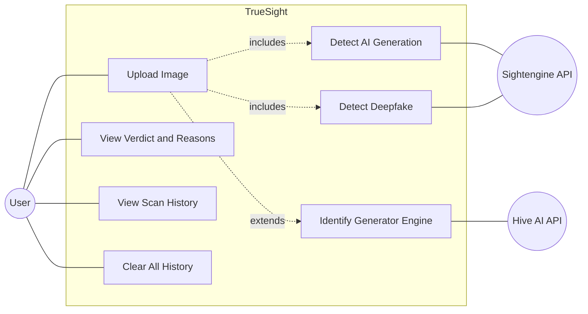
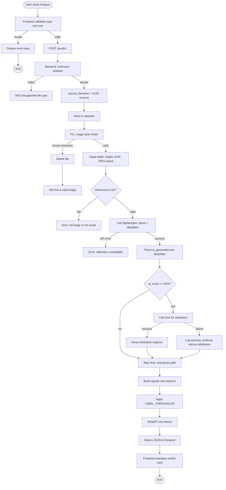
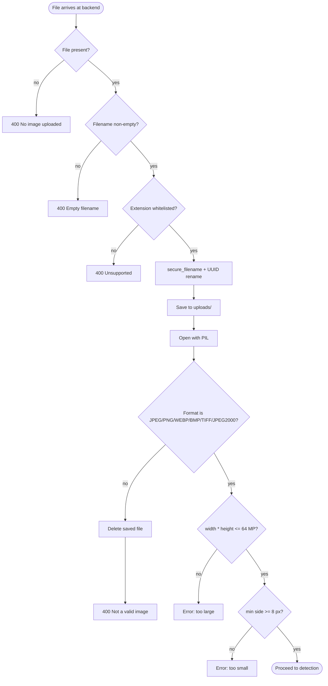

# 5. Analysis Phase

## 5.1 Actors

Three actors participate in TrueSight's operations: the **User** (a person uploading an image from any device on the LAN), the **Sightengine API** (invoked once per scan for AI-generation and deepfake probabilities), and the **Hive AI API** (invoked only when Sightengine judges an image AI, purely for generator attribution).

## 5.2 Use Case Diagram

The user has direct access to four use cases. The remaining three — Detect AI Generation, Detect Deepfake, Identify Generator Engine — are internal to the Upload-Image workflow. The "include" relationships fire on every upload; the "extend" relationship (Identify Generator Engine) fires only when Sightengine has already judged the image AI.

## 5.3 Use Case Specifications

### 5.3.1 UC-1 Upload Image

| Field | Content |
| --- | --- |
| **Actor** | User |
| **Goal** | Submit an image and receive a verdict with supporting forensic evidence. |
| **Preconditions** | Backend running; image file no larger than 12 MB and within 64 megapixels. |
| **Main flow** | (1) User selects image. (2) Frontend validates type and size. (3) User clicks Analyze. (4) Backend validates extension, renames to UUID, checks magic bytes and dimensions. (5) Backend calls Sightengine. (6) If AI score ≥ 50%, backend calls Hive for attribution. (7) Backend composes verdict and persists to history. (8) Frontend renders verdict card with reasons and signals. |
| **Alternate flows** | A. File rejected client-side — toast error. B. File rejected by backend validation — inline error. C. Sightengine unreachable — Error verdict. D. Hive unreachable but Sightengine succeeded — verdict returns with a "no attribution" note. |
| **Postconditions** | History row inserted; image stored under UUID filename. |

### 5.3.2 UC-2 View Verdict and Reasons

| Field | Content |
| --- | --- |
| **Actor** | User |
| **Goal** | Understand the system's reasoning. |
| **Preconditions** | A scan has just completed. |
| **Main flow** | (1) User reads verdict label and confidence. (2) User opens the Detection Details modal. (3) Modal shows bullet-point reasons, per-signal scores, attribution rows, and EXIF metadata summary. (4) User closes the modal. |
| **Postconditions** | None (read-only). |

### 5.3.3 UC-3 View Scan History

| Field | Content |
| --- | --- |
| **Actor** | User |
| **Goal** | Review previously-analysed images. |
| **Preconditions** | At least one scan exists. |
| **Main flow** | (1) User clicks History tab. (2) Frontend requests `GET /history`. (3) Backend returns the most recent fifty rows, newest first. (4) Frontend renders thumbnails with verdict, score, and timestamp. |
| **Alternate flow** | History empty — empty-state message displayed. |

### 5.3.4 UC-4 Clear All History

| Field | Content |
| --- | --- |
| **Actor** | User |
| **Goal** | Permanently remove all stored scans and uploaded files. |
| **Preconditions** | History tab active. |
| **Main flow** | (1) User clicks Clear History. (2) Backend deletes all files in `uploads/` and truncates the `history` table. (3) Frontend refreshes to the empty state. |
| **Postconditions** | `history` table empty; `uploads/` directory empty. |

## 5.4 Activity Diagrams

### 5.4.1 `/predict` request lifecycle

The diamond at `ai_score >= 50%` is the central design decision of the project — it gates whether Hive is called. The diamonds at format and dimension validation close off the validation stack before any external API is contacted, ensuring no API quota is spent on invalid input.

### 5.4.2 Input validation stack

The five layers are deliberately ordered cheapest first: presence and extension checks complete in microseconds; PIL parsing and dimension reading are reserved for files that have already cleared the cheaper gates.
