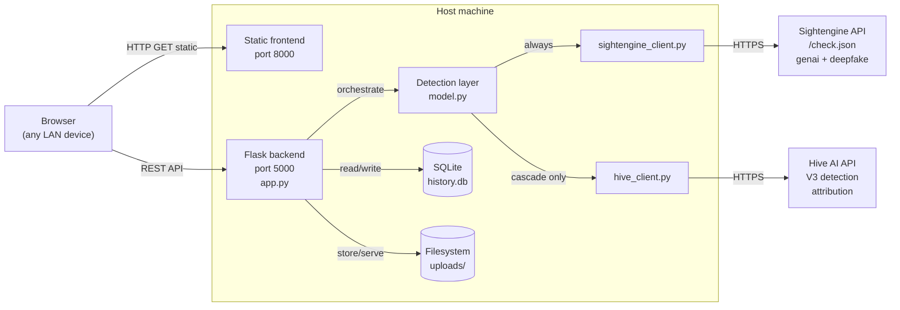
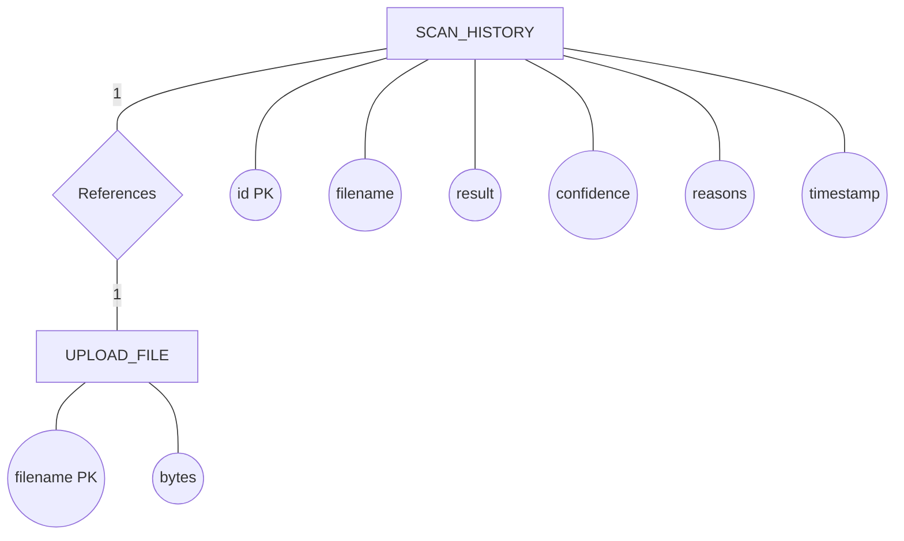

# 6. Design Phase

## 6.1 Application Architecture — Context Diagram

The system partitions into four host-side components — a static frontend, a Flask backend, the detection layer, and the persistence layer — plus two external services: the Sightengine API (always called) and the Hive AI API (called only on the cascade).



Two design choices warrant mention. First, **each external provider has its own client module**, so adding or replacing a provider involves writing one file and changing one import. Second, **the arrow from Detection to Hive_Client is labelled "cascade only"** — this captures the project's central design decision and distinguishes the architecture from a naive parallel-provider implementation. Persistence is split between SQL (structured metadata in `history.db`) and the filesystem (binary image content under UUID filenames in `uploads/`); storing image bytes inside SQLite would bloat the database without benefit.

## 6.2 Data Architecture

### 6.2.1 Entity–Relationship Diagram

The diagram below follows Chen notation: rectangles are entities, ovals are attributes, and the diamond is the relationship between the two entities with its cardinality labelled on the connecting lines.



The `HISTORY` table and the `UPLOADS_FILE` directory entries are connected by an implicit one-to-one relationship through `filename`. The relationship is enforced by application logic rather than a database foreign-key constraint, because `UPLOADS_FILE` is a directory listing rather than a SQL entity. The two are kept in sync by two mechanisms: on every successful scan the same UUID is both saved as a file and inserted into the row, and on `DELETE /clear_history` every file under `uploads/` is deleted together with every row in `HISTORY`.

### 6.2.2 Logical schema

```sql
CREATE TABLE IF NOT EXISTS history (
    id          INTEGER PRIMARY KEY AUTOINCREMENT,
    filename    TEXT    NOT NULL,
    result      TEXT    NOT NULL,
    confidence  REAL,
    reasons     TEXT,
    timestamp   TEXT
);
```

The `id` column provides a surrogate primary key whose monotonic ordering supports "newest first" history queries without a separate sequence column. `filename` is the UUID-renamed file's name on disk and is `NOT NULL` because every row corresponds to a stored image. `result` is the verdict label, drawn from a closed vocabulary {AI Generated, Likely AI Generated, Suspicious / Inconclusive, Likely Real, Real Photo, Error}; the vocabulary is small and stable enough not to warrant a separate reference table. `confidence` holds the Sightengine AI-generation probability as a percentage. `reasons` is the bullet-point forensic report serialised as JSON, stored together because reasons are read and written as a unit. `timestamp` holds the local time of the scan at minute granularity.

### 6.2.3 Indexes and query patterns

No secondary indexes are defined. The single high-frequency query is `SELECT * FROM history ORDER BY id DESC LIMIT 50`, which a full table scan answers in microseconds at the read-cap of fifty rows. The table size in normal use is in the hundreds at most, well below the threshold at which indexing would matter.

### 6.2.4 Why a single table is sufficient

A more normalised design might split the schema into `scans`, `verdicts`, and `reasons` tables joined by foreign keys. Three considerations argue against this. First, there are no shared verdicts and no shared reasons — each scan produces a bespoke list. Second, there are no concurrent writers; the standard motivation for normalisation (avoiding update anomalies under concurrency) does not apply. Third, the read pattern is "fetch one scan's full record" or "list the last fifty"; no analytical query touches multiple tables. The single-table design is the simplest model that satisfies every requirement and exposes the smallest surface area for bugs.
