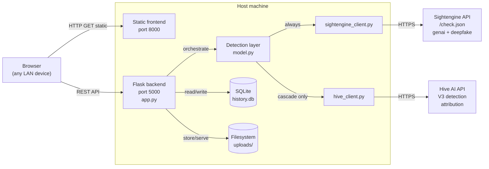
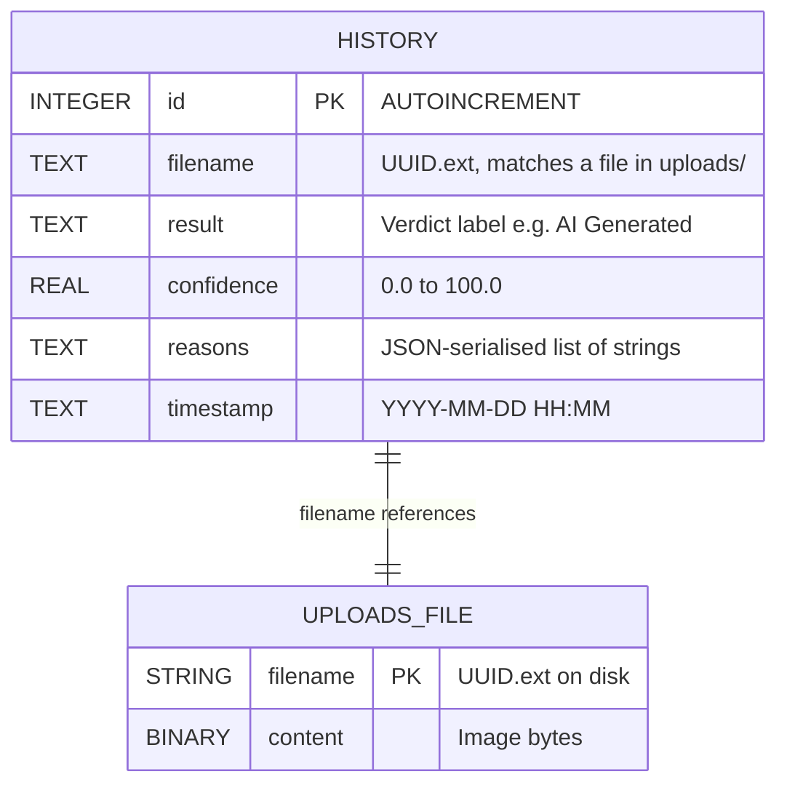

# 6. Design Phase

This chapter translates the requirements and the analysis-phase models into a concrete system design. Two artefacts dominate: the application-level architecture (the context diagram, showing how TrueSight's components relate to one another and to external services) and the data architecture (the ER diagram and logical schema for the persistent store).

## 6.1 Application Architecture — Context Diagram

The system is partitioned into four collaborating components on the host machine plus two external services.

The components on the host:

- A **Browser** rendering the single-page frontend over HTTP on port 8000 (served by Python's built-in `http.server`).
- A **Flask backend** on port 5000 handling all API routes — `/predict`, `/history`, `/clear_history`, `/uploads/<filename>`.
- A **Detection layer** inside the backend (`backend/ai_model/model.py`) that orchestrates external calls, local forensic inspection, and verdict synthesis.
- A **persistence layer** comprising a SQLite database (`backend/history.db`) and the uploads folder (`backend/uploads/`).

The two external services:

- **Sightengine API** at `https://api.sightengine.com/1.0/check.json`, called with `models=genai,deepfake` for every accepted image.
- **Hive AI API** at the V3 AI-generated-content-detection endpoint, called only when an image is judged AI.

> **Export to PNG**: paste the following Mermaid code into https://mermaid.live → Actions → PNG.



The arrow from **Detection** to **Hive_Client** is labelled *cascade only* to capture the project's central design decision: Hive is contacted only when the Sightengine response indicates AI generation. This is what makes the cascade architecture distinct from a naive parallel-provider implementation.

### 6.1.1 Why the components are separated this way

- **Frontend and backend run as separate processes on different ports** so that the frontend can be served as plain static files (no template engine, no build pipeline) while the backend remains a focused JSON API.
- **The detection layer is isolated from Flask** so that `predict_image()` can be invoked from anywhere — the web request handler, the `evaluate.py` batch harness, the `verify_sightengine.py` smoke test, or a future CLI. The Flask layer never knows which API providers are involved.
- **Each external provider has its own client module** so adding or replacing a provider involves writing one file and changing one import in `model.py`. The orchestration logic in `model.py` is the only file that knows which providers participate in a verdict.
- **Persistence is split between SQL and the filesystem** because the natural representation for the structured metadata (verdict, confidence, reasons, timestamp) is a database row, and the natural representation for binary image content is a file on disk referenced by a UUID filename. Storing image bytes inside SQLite would bloat the database without benefit.

## 6.2 Data Architecture

The persistent state of TrueSight is intentionally minimal: a single SQLite table, `history`, plus the contents of the `uploads/` directory addressed by UUID filenames.

### 6.2.1 Entity–Relationship Diagram

> **Export to PNG**: paste the following Mermaid code into https://mermaid.live → Actions → PNG.



The `HISTORY` and `UPLOADS_FILE` entities are connected by an implicit one-to-one relationship through `filename`. The relationship is **enforced by application logic**, not by a database foreign-key constraint, because `UPLOADS_FILE` is not a SQL entity — it is a directory listing. The two are kept in sync by two mechanisms:

1. On every successful scan, the same UUID-generated `filename` value is both saved as a file under `uploads/` and inserted into the `HISTORY` row.
2. On `DELETE /clear_history`, every file in `uploads/` is deleted and every row in `HISTORY` is truncated, in a single endpoint handler.

### 6.2.2 Logical schema (Database Logical Design)

The complete schema is created at backend startup by `init_db()` in `backend/app.py`:

```sql
CREATE TABLE IF NOT EXISTS history (
    id          INTEGER PRIMARY KEY AUTOINCREMENT,
    filename    TEXT    NOT NULL,
    result      TEXT    NOT NULL,
    confidence  REAL,
    reasons     TEXT,
    timestamp   TEXT
);
```

Column-by-column annotation:

- **`id`** — Surrogate primary key. SQLite's `AUTOINCREMENT` guarantees monotonically-increasing values, which is convenient for "newest first" ordering without a separate sequence column.
- **`filename`** — The UUID-renamed filename of the uploaded image, including extension. Examples: `f8d2e1c4a9b04d3f8e1c4a9b04d3f8e1.jpg`. The same string is used as the file's name on disk under `backend/uploads/`. `NOT NULL` because every history row corresponds to a stored image; there is no "history without a file" use case.
- **`result`** — The verdict label, drawn from the closed vocabulary `{AI Generated, Likely AI Generated, Suspicious / Inconclusive, Likely Real, Real Photo, Error}`. Stored as plain text rather than as a foreign-key reference to a separate `labels` table because the vocabulary is small, stable, and not user-editable. `NOT NULL`.
- **`confidence`** — A real number in the range 0.0–100.0 representing the Sightengine `genai` probability expressed as a percentage. Nullable in principle but in practice always present on successful scans; `Error` scans omit it.
- **`reasons`** — A JSON-serialised list of human-readable strings — the bullet-point forensic report. Stored as text rather than as a separate `reasons` child table because reasons are read together as a unit (the whole list, every time), never queried individually, and never updated after insertion.
- **`timestamp`** — Local time of the scan formatted as `"YYYY-MM-DD HH:MM"`. Stored as text rather than as an integer Unix timestamp because the only consumers are human-facing displays in the history view; the precision-loss to minute granularity is acceptable.

### 6.2.3 Indexes and queries

No secondary indexes are defined. The largest query the application issues is `SELECT * FROM history ORDER BY id DESC LIMIT 50`, which a full table scan answers in microseconds at the 50-row read cap, and the table is hard-capped only by the user's manual clearing — practical sizes during use are in the hundreds, well below the threshold where indexing would matter.

### 6.2.4 Why a single table is sufficient

A more aggressive design might split the schema into three tables — `scans`, `verdicts`, `reasons` — joined by foreign keys. Three considerations argue against that:

1. **There are no shared verdicts and no shared reasons.** Each scan produces its own bespoke reasons list. Normalising would not eliminate any duplication.
2. **There are no concurrent writers.** The system is single-user and single-process; the standard motivation for a normalised schema (avoiding update anomalies during concurrent modification) does not apply.
3. **The read pattern is "fetch one scan's full record" or "list the last fifty."** No analytical query touches multiple tables.

The single-table design is the simplest model that satisfies every requirement in chapter 4 and exposes the smallest surface area for bugs. The schema can always be migrated to a normalised form later if requirements change.
