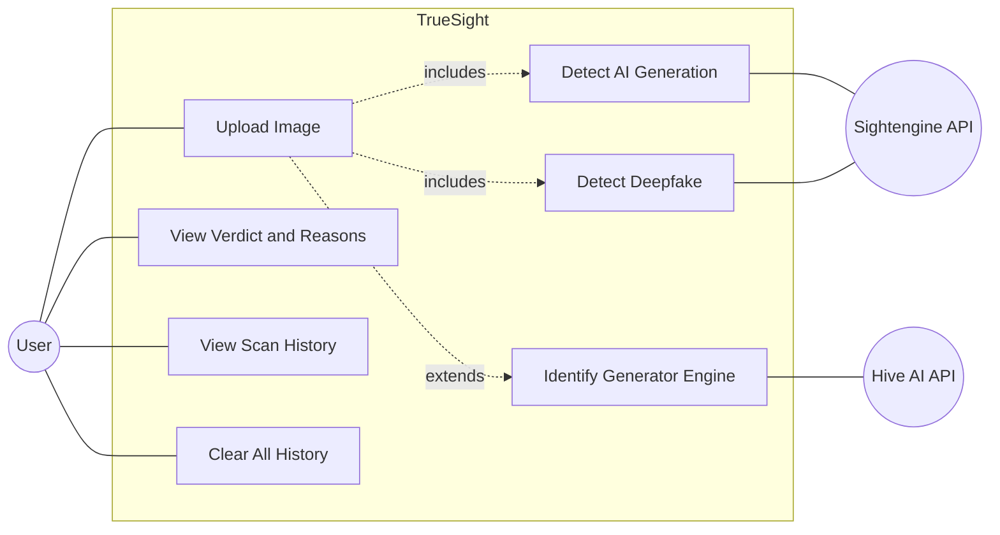
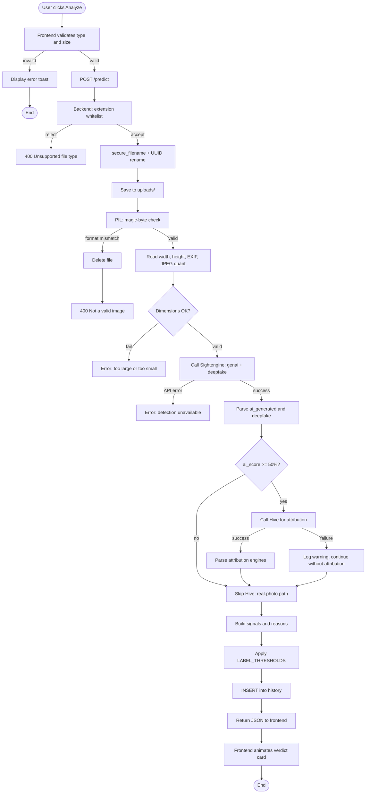
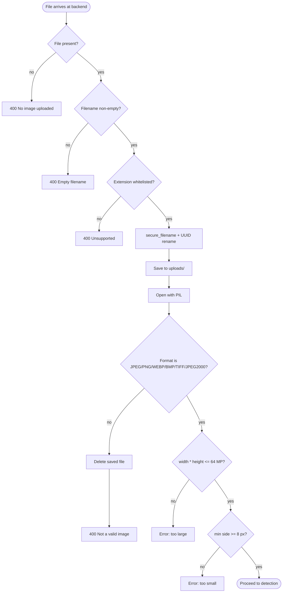
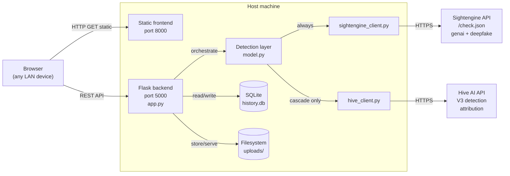
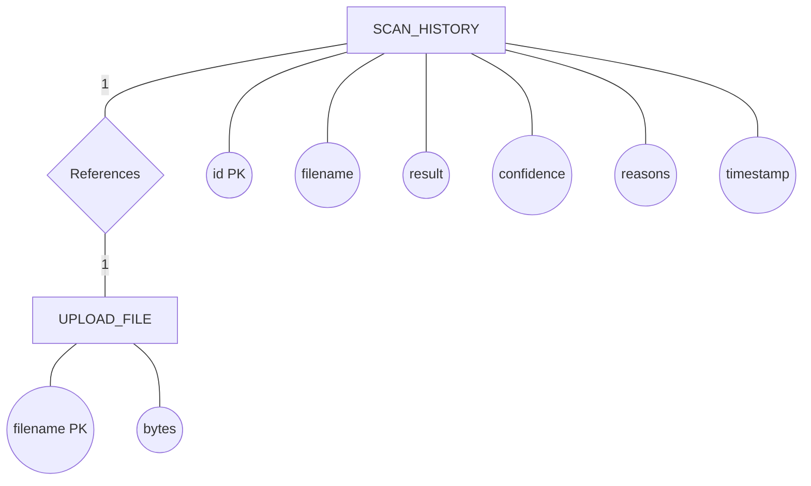

# 1. Introduction

In March 2023, an AI-generated image of Pope Francis in a Balenciaga puffer jacket spread across social media as if it were real, deceiving millions of viewers. Two months earlier, fabricated images depicting the arrest of a former United States president had gone viral in the same way. By 2024, generative-image models — Midjourney, DALL·E, Stable Diffusion, Google Gemini's Imagen, and a long tail of open-source diffusion variants — had crossed the threshold beyond which the average human reader can no longer reliably distinguish their output from authentic photography. Journalism cannot trust the photographs it receives without verification; courts cannot trust photographic exhibits without provenance; and an ordinary person scrolling a feed has no easy way to ask the basic question: *is this real?*

A small market of detection tools has emerged in response — Hive AI, Sightengine, Optic, Illuminarty, Microsoft's "About this image", and others — but each is constrained in similar ways. They are **cloud-only**, requiring the user to upload images to third-party servers. They are **account-gated** and rate-limited. And they return **opaque verdicts**, reporting that an image is "87% AI" without explaining the reasoning or surfacing the auxiliary forensic evidence (metadata, compression history, provenance signatures) that a sceptical user could weigh independently.

**TrueSight** is a graduation-project response to those constraints. It is a local-network web application that classifies uploaded images as AI-generated, deepfake, or authentic, and produces a forensic report explaining the verdict in plain language. The system orchestrates two commercial detection APIs — Sightengine for AI-generation and deepfake probabilities, and Hive AI for per-engine generator attribution — in a cost-aware cascade: Hive is contacted only when Sightengine has already judged an image as AI. On top of the API verdicts, TrueSight layers on-device forensic signals — EXIF metadata inspection, JPEG quantization analysis, dimension and format validation — that run without network access and qualify the verdict for the user. The application runs on a user's personal computer and is reachable from any device on the same local-area network. A local SQLite database remembers the user's past scans.

TrueSight does not train its own classifier. Training a competitive detector requires labelled examples spanning current generators, which evolve faster than any retraining cycle a student could maintain. An earlier prototype of this project (version 1.0) ran a five-model PyTorch ensemble locally; the system was slow on consumer hardware and outdated within months. The architectural pivot to API-driven detection (v1.1) and then to the cascade design (v1.2) was a deliberate engineering choice — current detection from external providers, system design and forensic value-add built around it.

This dissertation documents the requirements, analysis, design, implementation, and evaluation of TrueSight. The system was evaluated against a manually-curated test set of 59 images spanning twelve named AI generators and a representative selection of authentic photographs. It achieved 98.3 percent accuracy, 100 percent precision, 97.5 percent recall, and an F1 score of 98.7 percent, with a single misclassification: a Reddit-sourced image whose original post explicitly identified it as a generation chosen for exceptional photorealism.


# 2. Project Overview and Objectives

## 2.1 Project statement

**TrueSight** is a self-hosted, local-network web application for the forensic analysis of digital images. Given an uploaded image, it determines whether the image is AI-generated, identifies the most probable generator engine when applicable, detects face-swap deepfake patterns, surfaces local metadata signals, and presents a forensic report alongside a persistent scan history. The implementation pairs two commercial detection APIs (Sightengine and Hive AI) in a cost-aware cascade with on-device forensic checks, wrapped in a Flask backend and a vanilla-JavaScript single-page frontend reachable from any device on the user's Wi-Fi network.

## 2.2 Objectives

1. Classify uploaded images as AI-generated, deepfake, or authentic with a numeric confidence score.
2. Identify the most likely generator engine (Midjourney, DALL·E, Flux, Gemini, GPT-Image, Stable Diffusion, and others) when an image is judged AI.
3. Detect face-swap deepfake patterns in images containing faces.
4. Compute zero-cost on-device forensic signals — EXIF metadata, AI-software tag detection, JPEG compression heuristic.
5. Produce a plain-language forensic report rather than an opaque score.
6. Operate over LAN, accessible from any phone or laptop on the same network without requiring an account.
7. Persist scan history locally in SQLite, with the most recent fifty scans presented in a dedicated view.
8. Provide an automated evaluation framework that produces a confusion matrix and standard classification metrics against a labelled test set.

## 2.3 Out of scope

The following are explicitly **not** project objectives: training a proprietary detection model; authentication or multi-user isolation; HTTPS, rate limiting, or production-grade web serving; adversarial robustness; video analysis; cryptographic provenance (C2PA / Content Credentials) reading.

## 2.4 Project evolution

| Version | What changed | Why |
| --- | --- | --- |
| **1.0** | Five locally-installed PyTorch image classifiers running as an ensemble jury. | Initial proof of concept; heavy dependencies, slow on consumer hardware, outdated as new generators appeared. |
| **1.1** | Replaced the ensemble with Hive AI's V3 Detection API. | Lightweight and fast; gained per-engine attribution; Hive remained sole detection provider. |
| **1.2** | Sightengine becomes primary detector (AI-generation + deepfake in one call); Hive repositioned as a cost-aware secondary lookup invoked only when an image is judged AI. Threshold logic centralised, `logging` adopted, evaluation framework introduced. | Sightengine offers better current-generator coverage and an explicit deepfake head; the cascade saves an estimated 50 percent of Hive quota; centralised thresholds and structured logging are graduation-grade engineering polish. |

Version 1.2 is the system described in this dissertation. The progression illustrates a deliberate trade-off: rather than chase ever-larger local models, the project pivoted to a system-level value-add — orchestration, forensic layering, presentation — built on top of cloud detection that stays current without retraining cycles.


# 3. Literature Review

This chapter surveys existing systems that attempt to answer "is this image AI-generated?" — both consumer-grade detection tools and the emerging cryptographic-provenance standards. The goal is to position TrueSight in the comparison space and to identify the gap it occupies.

## 3.1 Detection-based tools

### 3.1.1 Hive AI Moderation

Hive Inc. (founded 2017) operates large-scale content-moderation models used by Reddit, OpenAI's ChatGPT moderation pipeline, and several social platforms. Its public AI-image detector at `hivemoderation.com/ai-generated-content-detection` returns a probability that the image was AI-generated together with per-engine classification (which model generated it). Hive's V3 detection API — the one TrueSight uses as its attribution backend — exposes named heads for over a dozen generators including Midjourney, DALL·E, Flux, Stable Diffusion, GPT-Image, Gemini, Kling, Krea, Ideogram, and Grok. Hive's strength is the breadth and currency of its engine catalogue; its weakness is that it is closed-source and cloud-only, and the public demo requires account registration.

### 3.1.2 Sightengine

Sightengine is a French content-moderation API provider that offers, among many models, a `genai` model (AI-generation probability) and a `deepfake` model (face-swap probability). Both can be requested in a single `/check.json` call. The free tier allows 2,000 operations per month with a 500-per-day cap; the documentation publishes the exact per-model operation cost. Sightengine's strength is the bundled deepfake head and a clean REST API; its weakness, observed empirically during this project, is that the `ai_generators` sub-block returning per-engine attribution is not enabled on standard plans and is gated behind a "contact us" enterprise tier. TrueSight uses Sightengine as its primary detector.

### 3.1.3 Optic AI or Not

Available at `aiornot.com`, Optic offers a single-purpose binary classifier — "AI" or "Not AI" — with a confidence score. The tool is free with an account, processes uploaded images one at a time, and does not surface per-engine attribution or auxiliary forensic signals. Optic's strength is its single-page simplicity; its weakness is the lack of reasoning beyond the binary output.

### 3.1.4 Illuminarty

Available at `app.illuminarty.ai`, Illuminarty differentiates itself by producing a probability heat-map highlighting which regions of the image are most likely AI-generated. This is qualitatively different from a single global score and supports localised tampering analysis. The free tier has rate limits. Illuminarty's strength is the regional view; its weakness is that it lacks an explicit deepfake head and offers less generator-attribution detail than Hive.

### 3.1.5 Microsoft "About this image"

Integrated into Bing Search and Copilot since late 2023, "About this image" is *provenance-based* rather than classification-based. When the user invokes it, the system performs a reverse-image search across indexed pages, returns the earliest dates and locations the image has appeared, and surfaces any embedded C2PA content credentials. This is not "is this AI?" but "what is the history of this file?" The strength is that provenance evidence is more durable than classifier confidence — a real photo with documented Reuters provenance is genuinely real. The weakness is that the system fails silently for new images, images that have been re-encoded since their original publication, or images that have never been crawled.

### 3.1.6 OpenAI's discontinued classifier

OpenAI launched a public AI-text classifier in January 2023 and discontinued it on 20 July 2023, citing low accuracy in detecting AI-generated text. The discontinuation is itself a useful citation: the company that trained the leading generators publicly admitted that detection through classification was not reliable enough to deploy. Although OpenAI's image-generation product (DALL·E) embeds content credentials in its outputs, OpenAI does not currently offer a public AI-image classifier.

## 3.2 Provenance-based standards

### 3.2.1 C2PA — Coalition for Content Provenance and Authenticity

Founded in 2021 by Adobe, Microsoft, BBC, Intel, Truepic, and others, C2PA is the industry standard for cryptographically signing image provenance at creation time. A camera or generative model that supports C2PA writes a signed manifest into the image's metadata describing how the image was produced, what was done to it, and by whom. The signature can be verified anywhere the public-key infrastructure is reachable. As of 2025 the standard is implemented natively by Adobe Firefly, OpenAI DALL·E 3, and several Sony and Leica camera bodies. Its strength is that it makes provenance verifiable without classification at all; its limitation is that an image stripped of metadata loses every C2PA assertion, so the standard protects authenticated images but does not classify unauthenticated ones.

### 3.2.2 Adobe Content Credentials

Content Credentials is Adobe's user-facing implementation of C2PA. The "CR" pin icon appears on supported images on supporting platforms (currently Behance, LinkedIn, and Adobe's own products), letting a viewer click through to inspect the provenance chain. Content Credentials is the most visible deployment of C2PA outside the specification itself.

## 3.3 Academic foundations

Three lines of academic work inform the broader field. The first is **classification of synthetic images by CNN artefacts** — Wang, Wang, Owens and Efros's 2020 CVPR paper "CNN-generated images are surprisingly easy to spot... for now" demonstrated that early GAN outputs had distinctive frequency-domain artefacts that classifiers could exploit; subsequent diffusion models are harder to detect with the same techniques. The second is **deepfake detection surveys** — Mirsky and Lee's 2021 ACM Computing Surveys article "The Creation and Detection of Deepfakes" is the standard reference for the face-swap detection problem. The third is **the calibration and generalisation gap** — multiple recent papers have shown that detectors trained on one generator's outputs do not generalise to the next generation of generators, which is the underlying reason behind both Sightengine's near-binary score distribution observed in this project's evaluation and Hive's need to continually expand its engine catalogue.

## 3.4 Comparative summary

| System | Method | Deepfake | Engine attribution | Deployment | Privacy | Reasoning shown | Account needed |
| --- | --- | --- | --- | --- | --- | --- | --- |
| Hive AI Moderation | CNN classifier (multi-head) | Yes | Yes (12+ engines) | Cloud | Image uploaded to Hive servers | Single score per head | Yes |
| Sightengine | Classifier API | Yes (separate `deepfake` model) | Plan-gated (enterprise tier only) | Cloud | Image uploaded to Sightengine | Single score per model | Yes (API key) |
| Optic AI or Not | Classifier | No | No | Cloud | Image uploaded | Binary verdict | Yes |
| Illuminarty | Region-localised classifier | Indirect via region map | Limited | Cloud | Image uploaded | Heat-map | Yes |
| Microsoft "About this image" | Reverse search + C2PA | No (provenance-based) | Indirect via origin | Cloud (Bing) | Image fingerprinted, not stored | Provenance trail | No (Bing account optional) |
| OpenAI Image Classifier | (discontinued July 2023) | — | — | — | — | — | — |
| C2PA / Content Credentials | Cryptographic signing at source | N/A | N/A | Embedded in file | Local (no upload required) | Provenance manifest | No |
| **TrueSight (this work)** | **API cascade + local forensic signals** | **Yes (Sightengine)** | **Yes (Hive cascade)** | **Local (LAN)** | **High — image only leaves device for the API call** | **Bullet-point reasons list** | **No (LAN-only)** |

## 3.5 Where TrueSight differs

The comparison shows that no existing tool combines all of the following: local deployment, on-device forensic signals (EXIF, JPEG quantization), multi-provider cascade for cost-aware attribution, persistent local history, and a transparent reasoning list rather than an opaque score. Each cloud competitor sacrifices privacy by requiring upload to a third-party server, sacrifices transparency by returning a single number, or sacrifices currency by relying on a single classifier head whose engine catalogue lags the generator landscape. Each provenance-based tool sacrifices coverage by failing to classify images that lack C2PA credentials, which is almost everything in the wild.

TrueSight occupies the unfilled niche: a *local, multi-provider, forensic-reasoning* detector. It does not claim a novel classification algorithm — the classifiers are Sightengine's and Hive's — but it integrates two third-party detectors with on-device signals in a configuration that no comparator offers.


# 4. Requirements Phase

## 4.1 Functional requirements

| ID | Requirement |
| --- | --- |
| **FR-1** | The system shall accept an image upload through the web interface via drag-and-drop or a file picker, restricted to JPEG, PNG, WEBP, BMP, TIFF, and JPEG 2000 formats up to 12 MB and 64 megapixels. |
| **FR-2** | The system shall validate every upload through five sequential checks — extension whitelist, `secure_filename` sanitisation, UUID rename, PIL magic-byte format verification, and dimension cap — rejecting any file that fails before contacting an external service. |
| **FR-3** | The system shall classify each accepted image using Sightengine's `genai` and `deepfake` models, obtaining an AI-generation probability and a face-swap probability. |
| **FR-4** | When the AI-generation probability is at least 50 percent, the system shall additionally call Hive AI to extract per-engine generator attribution. When the probability is below this threshold the system shall not contact Hive. |
| **FR-5** | The system shall compute local forensic signals on every image: EXIF camera and software tag extraction, detection of known AI-generation software names in the EXIF Software field, and a JPEG-quantization heuristic that flags heavily-compressed images. |
| **FR-6** | The system shall produce a verdict consisting of a label drawn from {AI Generated, Likely AI Generated, Suspicious / Inconclusive, Likely Real, Real Photo}, a confidence percentage, a list of plain-language reasons, and a dictionary of per-signal scores. |
| **FR-7** | The system shall persist every successful scan to a local SQLite database, recording filename, verdict, confidence, reasons, and timestamp, and shall expose the most recent fifty scans through a history endpoint. |
| **FR-8** | The system shall provide a single user action that wipes the entire scan history and deletes every uploaded image file. |
| **FR-9** | The system shall be reachable from any device on the same local-area network, with the backend binding to `0.0.0.0` and the frontend computing the backend URL from the request hostname. |
| **FR-10** | The system shall provide an automated evaluation harness that reads ground-truth labels, runs every labelled image through the detection pipeline, computes accuracy / precision / recall / F1 plus a confusion matrix, and supports resume from cache after partial failure. |

## 4.2 Non-functional requirements

| ID | Requirement |
| --- | --- |
| **NFR-1** | A single detection request shall complete within 60 seconds. Validation failures shall return within 1 second without contacting any external API. |
| **NFR-2** | Uploaded filenames shall be sanitised with `werkzeug.utils.secure_filename` and replaced with a UUID before storage, preventing path-traversal attacks and ensuring no original filename is persisted. |
| **NFR-3** | API responses (excluding `/uploads/*`) shall include `Cache-Control: no-store`. API credentials shall be loaded from a `.env` file that is gitignored; the repository ships a `.env.example` containing placeholders only. |
| **NFR-4** | Failure of the Hive attribution call shall not block the verdict — the system shall degrade gracefully to a Sightengine-only result. Failure of the Sightengine call shall produce a user-readable Error verdict without crashing. |
| **NFR-5** | The user interface shall be fully operable from the keyboard, expose ARIA roles for the upload zone, tab navigation, and modal dialogs, and respect the user's `prefers-reduced-motion` setting. |
| **NFR-6** | The interface shall offer light and dark themes, persisted to `localStorage` and applied before first paint, and shall be responsive from 360-pixel mobile viewports up to desktop widths. |
| **NFR-7** | All detection thresholds — binary classification cutoff, verdict-label brackets, deepfake severity bands, JPEG compression cutoff — shall be defined as named constants in a single block at the top of `backend/ai_model/model.py`. |
| **NFR-8** | The detection backend shall be provider-agnostic: each external API is encapsulated behind a thin HTTP client, with the orchestration logic in `model.py` as the only file that knows which providers are called. |
| **NFR-9** | All Python dependencies shall be pinned to exact versions in `requirements.txt`. The backend shall depend on no machine-learning libraries; image handling uses Pillow only. |
| **NFR-10** | The system shall use the standard `logging` module rather than `print()` for diagnostic output, with verbosity controllable through a `LOG_LEVEL` environment variable. |


# 5. Analysis Phase

## 5.1 Actors

Three actors participate in TrueSight's operations: the **User** (a person uploading an image from any device on the LAN), the **Sightengine API** (invoked once per scan for AI-generation and deepfake probabilities), and the **Hive AI API** (invoked only when Sightengine judges an image AI, purely for generator attribution).

## 5.2 Use Case Diagram



The user has direct access to four use cases. The remaining three — Detect AI Generation, Detect Deepfake, Identify Generator Engine — are internal to the Upload-Image workflow. The "include" relationships fire on every upload; the "extend" relationship (Identify Generator Engine) fires only when Sightengine has already judged the image AI.

## 5.3 Use Case Specifications

### 5.3.1 UC-1 Upload Image

| Field | Content |
| --- | --- |
| **Actor** | User |
| **Goal** | Submit an image and receive a verdict with supporting forensic evidence. |
| **Preconditions** | Backend running; image file no larger than 12 MB and within 64 megapixels. |
| **Main flow** | (1) User selects image. (2) Frontend validates type and size. (3) User clicks Analyze. (4) Backend validates extension, renames to UUID, checks magic bytes and dimensions. (5) Backend calls Sightengine. (6) If AI score ≥ 50%, backend calls Hive for attribution. (7) Backend composes verdict and persists to history. (8) Frontend renders verdict card with reasons and signals. |
| **Alternate flows** | A. File rejected client-side — toast error. B. File rejected by backend validation — inline error. C. Sightengine unreachable — Error verdict. D. Hive unreachable but Sightengine succeeded — verdict returns with a "no attribution" note. |
| **Postconditions** | History row inserted; image stored under UUID filename. |

### 5.3.2 UC-2 View Verdict and Reasons

| Field | Content |
| --- | --- |
| **Actor** | User |
| **Goal** | Understand the system's reasoning. |
| **Preconditions** | A scan has just completed. |
| **Main flow** | (1) User reads verdict label and confidence. (2) User opens the Detection Details modal. (3) Modal shows bullet-point reasons, per-signal scores, attribution rows, and EXIF metadata summary. (4) User closes the modal. |
| **Postconditions** | None (read-only). |

### 5.3.3 UC-3 View Scan History

| Field | Content |
| --- | --- |
| **Actor** | User |
| **Goal** | Review previously-analysed images. |
| **Preconditions** | At least one scan exists. |
| **Main flow** | (1) User clicks History tab. (2) Frontend requests `GET /history`. (3) Backend returns the most recent fifty rows, newest first. (4) Frontend renders thumbnails with verdict, score, and timestamp. |
| **Alternate flow** | History empty — empty-state message displayed. |

### 5.3.4 UC-4 Clear All History

| Field | Content |
| --- | --- |
| **Actor** | User |
| **Goal** | Permanently remove all stored scans and uploaded files. |
| **Preconditions** | History tab active. |
| **Main flow** | (1) User clicks Clear History. (2) Backend deletes all files in `uploads/` and truncates the `history` table. (3) Frontend refreshes to the empty state. |
| **Postconditions** | `history` table empty; `uploads/` directory empty. |

## 5.4 Activity Diagrams

### 5.4.1 `/predict` request lifecycle



The diamond at `ai_score >= 50%` is the central design decision of the project — it gates whether Hive is called. The diamonds at format and dimension validation close off the validation stack before any external API is contacted, ensuring no API quota is spent on invalid input.

### 5.4.2 Input validation stack



The five layers are deliberately ordered cheapest first: presence and extension checks complete in microseconds; PIL parsing and dimension reading are reserved for files that have already cleared the cheaper gates.


# 6. Design Phase

## 6.1 Application Architecture — Context Diagram

The system partitions into four host-side components — a static frontend, a Flask backend, the detection layer, and the persistence layer — plus two external services: the Sightengine API (always called) and the Hive AI API (called only on the cascade).



Two design choices warrant mention. First, **each external provider has its own client module**, so adding or replacing a provider involves writing one file and changing one import. Second, **the arrow from Detection to Hive_Client is labelled "cascade only"** — this captures the project's central design decision and distinguishes the architecture from a naive parallel-provider implementation. Persistence is split between SQL (structured metadata in `history.db`) and the filesystem (binary image content under UUID filenames in `uploads/`); storing image bytes inside SQLite would bloat the database without benefit.

## 6.2 Data Architecture

### 6.2.1 Entity–Relationship Diagram

The diagram below follows Chen notation: rectangles are entities, ovals are attributes, and the diamond is the relationship between the two entities with its cardinality labelled on the connecting lines.



The `HISTORY` table and the `UPLOADS_FILE` directory entries are connected by an implicit one-to-one relationship through `filename`. The relationship is enforced by application logic rather than a database foreign-key constraint, because `UPLOADS_FILE` is a directory listing rather than a SQL entity. The two are kept in sync by two mechanisms: on every successful scan the same UUID is both saved as a file and inserted into the row, and on `DELETE /clear_history` every file under `uploads/` is deleted together with every row in `HISTORY`.

### 6.2.2 Logical schema

```sql
CREATE TABLE IF NOT EXISTS history (
    id          INTEGER PRIMARY KEY AUTOINCREMENT,
    filename    TEXT    NOT NULL,
    result      TEXT    NOT NULL,
    confidence  REAL,
    reasons     TEXT,
    timestamp   TEXT
);
```

The `id` column provides a surrogate primary key whose monotonic ordering supports "newest first" history queries without a separate sequence column. `filename` is the UUID-renamed file's name on disk and is `NOT NULL` because every row corresponds to a stored image. `result` is the verdict label, drawn from a closed vocabulary {AI Generated, Likely AI Generated, Suspicious / Inconclusive, Likely Real, Real Photo, Error}; the vocabulary is small and stable enough not to warrant a separate reference table. `confidence` holds the Sightengine AI-generation probability as a percentage. `reasons` is the bullet-point forensic report serialised as JSON, stored together because reasons are read and written as a unit. `timestamp` holds the local time of the scan at minute granularity.

### 6.2.3 Indexes and query patterns

No secondary indexes are defined. The single high-frequency query is `SELECT * FROM history ORDER BY id DESC LIMIT 50`, which a full table scan answers in microseconds at the read-cap of fifty rows. The table size in normal use is in the hundreds at most, well below the threshold at which indexing would matter.

### 6.2.4 Why a single table is sufficient

A more normalised design might split the schema into `scans`, `verdicts`, and `reasons` tables joined by foreign keys. Three considerations argue against this. First, there are no shared verdicts and no shared reasons — each scan produces a bespoke list. Second, there are no concurrent writers; the standard motivation for normalisation (avoiding update anomalies under concurrency) does not apply. Third, the read pattern is "fetch one scan's full record" or "list the last fifty"; no analytical query touches multiple tables. The single-table design is the simplest model that satisfies every requirement and exposes the smallest surface area for bugs.


# 7. Implementation Phase

## 7.1 Languages used

| Layer | Language | Rationale |
| --- | --- | --- |
| Backend | Python 3.10+ | Flask is the lightest production-acceptable web framework; PIL handles every supported image format; `requests` covers the HTTP client need. Python 3.10 enables modern type hints (`tuple[int, int, ...]`) without `typing` imports. |
| Frontend | HTML5 / CSS3 / Vanilla JavaScript (ES2020) | A single-page application with five dynamic states. A framework would add a build step and runtime overhead without functional benefit. |
| Persistence | SQLite | Single-file database, zero administration, ships with Python. One table, no concurrency. |
| Configuration | dotenv | Standard, language-agnostic format for environment-variable injection. |
| Generated reports | Markdown | The evaluation harness produces Markdown because it renders natively on GitHub and converts cleanly to Word, PDF, and LaTeX. |

## 7.2 Tools used

### 7.2.1 Backend dependencies

Five packages, pinned to exact versions in `backend/requirements.txt`:

| Package | Version | Role |
| --- | --- | --- |
| `Flask` | 3.1.2 | HTTP server and routing |
| `flask-cors` | 6.0.2 | Cross-origin request handling for LAN access |
| `pillow` | 12.0.0 | Image opening, format detection, EXIF parsing, JPEG quantization |
| `requests` | 2.32.5 | HTTP client for Sightengine and Hive |
| `python-dotenv` | 1.2.2 | Loading API credentials from `.env` |

There are intentionally **no machine-learning libraries** — no `torch`, `transformers`, `onnxruntime`, `numpy`, or `scikit-learn`. Detection is API-driven and the only image-handling library is Pillow.

### 7.2.2 External services

| Service | Endpoint | Purpose |
| --- | --- | --- |
| Sightengine | `https://api.sightengine.com/1.0/check.json` | Primary detector — AI-generation and deepfake scores. Free tier 2,000 ops/month, 500/day. |
| Hive AI | V3 AI-Generated and Deepfake Content Detection | Secondary attribution lookup — called only when Sightengine flags an image AI. Returns per-engine classification heads. |

### 7.2.3 Development tools

Visual Studio Code as the primary editor; Git and GitHub for version control and public hosting; browser developer tools for UI inspection and responsive preview; PowerShell on Windows for backend launch and virtual-environment management; Mermaid Live Editor (`mermaid.live`) for rendering the diagrams in this dissertation to PNG.

## 7.3 Templates

The project uses no templating framework on either side. The Flask backend serves pure JSON (no Jinja2). The frontend is plain HTML, CSS, and JavaScript with no React, Vue, Svelte, or Angular runtime. This is a deliberate choice motivated by the project's lightness goal — version 1.0 used heavy ML dependencies and version 1.2 explicitly inverts that posture, choosing the simplest stack that satisfies every requirement.

## 7.4 Screenshots of the system

The seven screenshots listed in Appendix B are inserted at the positions below in the final document.

### 7.4.1 Home screen with the upload zone

`[INSERT SCREENSHOT: 01-home-upload-zone.png]`

The home screen presents a single primary action — a drag-and-drop upload zone that accepts JPEG, PNG, WEBP, BMP, and TIFF images up to 12 MB. The left-hand panel describes the project and lists its four headline features.

### 7.4.2 Verdict card on an AI-generated image

`[INSERT SCREENSHOT: 02-verdict-ai.png]`

A verdict card produced on a known Midjourney sample. Sightengine returns 99.0 percent confidence, placing the verdict in the "AI Generated" label bucket.

### 7.4.3 Detection details modal

`[INSERT SCREENSHOT: 03-details-modal.png]`

The modal exposes every signal that contributed to the verdict — the Sightengine AI Classifier score, the deepfake score, every Hive attribution row, the EXIF camera-and-software summary, and the bullet-point reasons list. This transparency distinguishes TrueSight from cloud detectors that return only an opaque score.

### 7.4.4 Verdict on a real photograph

`[INSERT SCREENSHOT: 04-verdict-real.png]`

The verdict card for an authentic Unsplash photograph. Sightengine returns 0.1 percent, placing the verdict in the "Real Photo" bucket. The Hive cascade was not invoked and no attribution rows are present.

### 7.4.5 History tab

`[INSERT SCREENSHOT: 05-history-tab.png]`

The history tab fetches the most recent fifty scans from the local SQLite database. Each row shows a thumbnail, the verdict label, the confidence percentage, and the timestamp.

### 7.4.6 Oversized-upload error

`[INSERT SCREENSHOT: 06-error-oversized.png]`

The frontend enforces the 12 MB upload cap client-side, surfacing the violation as a toast notification before any network request leaves the browser.

### 7.4.7 Dark theme

`[INSERT SCREENSHOT: 07-dark-theme.png]`

The dark theme is implemented through CSS custom properties on the `:root` and `[data-theme="dark"]` selectors. The chosen theme persists across sessions in `localStorage` and is applied before first paint to prevent a flash of the wrong theme on dark-mode reload.

## 7.5 Scenarios

**Journalist verifying a viral image.** A reporter receives a forwarded image of a public figure in an unusual situation. Before publication, the reporter opens TrueSight on the newsroom's local network from a phone, drops the image into the upload zone, and waits roughly ten seconds. The verdict returns "AI Generated" at 99 percent confidence with Midjourney named as the most likely generator. The reasons list highlights the absence of EXIF metadata. The reporter captures the verdict screen for the editorial trail and declines to publish. The image never leaves the LAN.

**Social-media moderator triaging user uploads.** A moderator works through a queue of reported images using TrueSight as a triage step before human review. Each upload completes in under thirty seconds. "AI Generated" and "Likely AI Generated" verdicts are routed to a dedicated review queue with the attribution preserved; "Real Photo" and "Likely Real" verdicts continue down the normal pipeline. The local SQLite history records every triage decision for later audit.

**Researcher labelling a dataset.** A researcher building a dataset of AI-generated images uses TrueSight's `evaluate.py` script to label a directory of candidate samples in bulk. Ground-truth labels are added to `Test/README.md` where the origin is known; the harness runs through the rest and produces a confusion matrix together with a Markdown report listing every misclassification. The disagreement cases — the "interesting failures" — become the focus of dataset review.

## 7.6 Sample reports

The evaluation harness produces a Markdown report after each run. The most recent run is summarised below; the full file is `evaluation_report.md` at the repository root.

### 7.6.1 Methodology

The test set comprised 59 manually-curated images — 40 ground-truth AI-generated samples spanning twelve named generator engines (Midjourney, Flux, DALL·E, GPT-Image v1.5 and v2, Gemini 3, Stable Diffusion, SDXL, Z-Image, Kling, Krea, Ideogram, Grok) plus several Reddit and viral-hoax AI images, and 19 ground-truth real photographs drawn from Unsplash, the New York Times CMS, NASA Hubble's public archive, Wikipedia portrait files, Flickr, and iStockphoto. Each image was passed through the full `predict_image()` pipeline. A prediction was classified as AI when the Sightengine `ai_generated` score was at least 50 percent and real otherwise.

### 7.6.2 Confusion matrix

AI is the positive class.

|                | Predicted Real | Predicted AI |
| -------------- | -------------- | ------------ |
| **True Real**  | 19 (TN)        | 0 (FP)       |
| **True AI**    | 1 (FN)         | 39 (TP)      |

### 7.6.3 Metrics

| Metric | Value | Interpretation |
| --- | --- | --- |
| Accuracy | **98.3 %** | Fraction of correct verdicts overall. |
| Precision | **100.0 %** | Of every image TrueSight labelled AI, the fraction that was actually AI. |
| Recall | **97.5 %** | Of every truly-AI image in the set, the fraction TrueSight correctly identified. |
| F1 | **98.7 %** | Harmonic mean of precision and recall — the headline metric for a class-imbalanced evaluation. |

The set is 68 percent AI and 32 percent real, a moderate imbalance. F1 is reported in preference to accuracy because F1 is insensitive to that skew — a naive detector that always says "AI" would achieve 68 percent accuracy on the same set, exposing a failure mode that the raw accuracy number conceals.

### 7.6.4 Failure analysis

The single misclassification was the file `its-still-nuts-to-me-how-realistic-ai-is-getting-incredible-v0-bcxd5awmq50h1.webp` — an AI-generated image sourced from a Reddit post whose title explicitly described it as a generation chosen for exceptional photorealism. Sightengine returned an AI score of 2.0 percent on this image, well below the 50 percent threshold, leading to a Real verdict. The case is significant beyond a single data point: it demonstrates the upper bound on what automated AI-image detection can achieve when generative models are specifically optimised to fool human perception, and it argues for layered defences (provenance signatures, EXIF analysis, source verification) rather than reliance on a single classifier head.

### 7.6.5 Observed properties of Sightengine's score distribution

A secondary observation from the evaluation: Sightengine's `ai_generated` scores were strongly bimodal. Of the 39 AI images correctly identified, every one received an `ai_generated` score of exactly 99.0 percent. Of the 19 real photographs, 18 received exactly 0.1 percent and one received 1.0 percent. Only a single image in the entire set produced an intermediate score (48.0 percent on an Unsplash photograph). This bimodality implies that the binary AI-vs-real verdict is largely insensitive to where the threshold is placed within the broad gap; the verdict-label brackets (85, 60, 45, 20) primarily affect the few in-between cases.


# 8. References

References follow IEEE numbered style. They are ordered in the sequence of first appearance in the document.

[1] Sightengine, "AI-generated Image Detection," *Sightengine Documentation*, 2026. [Online]. Available: https://sightengine.com/docs/ai-generated-image-detection

[2] Sightengine, "Deepfake Detection," *Sightengine Documentation*, 2026. [Online]. Available: https://sightengine.com/docs/deepfake-detection

[3] Hive AI, "AI-Generated Content Detection," *Hive Moderation*, 2026. [Online]. Available: https://hivemoderation.com/ai-generated-content-detection

[4] Hive AI, "AI-Generated and Deepfake Content Detection (V3) API Reference," *Hive Documentation*, 2026. [Online]. Available: https://docs.thehive.ai/

[5] Optic, "AI or Not — AI Image Detector," *aiornot.com*, 2026. [Online]. Available: https://www.aiornot.com

[6] Illuminarty, "AI Image Detector with Region Localisation," *Illuminarty*, 2026. [Online]. Available: https://app.illuminarty.ai

[7] Microsoft, "About this image — content credentials and provenance in Bing," *Microsoft Bing Blog*, 5 Sep 2023. [Online]. Available: https://blogs.bing.com/search/september-2023/Generative-AI-content-credentials

[8] OpenAI, "New AI classifier for indicating AI-written text," *OpenAI Blog*, 31 Jan 2023 (updated with discontinuation notice 20 Jul 2023). [Online]. Available: https://openai.com/blog/new-ai-classifier-for-indicating-ai-written-text

[9] Coalition for Content Provenance and Authenticity, "C2PA Technical Specification, version 2.1," *C2PA*, 2024. [Online]. Available: https://c2pa.org/specifications/

[10] Adobe, "Content Credentials — A new layer of media transparency," *Content Authenticity Initiative*, 2026. [Online]. Available: https://contentcredentials.org

[11] S.-Y. Wang, O. Wang, A. A. Efros, and R. Zhang, "CNN-generated images are surprisingly easy to spot... for now," in *Proc. IEEE/CVF Conf. Computer Vision and Pattern Recognition (CVPR)*, Seattle, USA, 2020, pp. 8695–8704.

[12] Y. Mirsky and W. Lee, "The Creation and Detection of Deepfakes: A Survey," *ACM Computing Surveys*, vol. 54, no. 1, pp. 1–41, Jan. 2022. doi: 10.1145/3425780

[13] Pallets Projects, "Flask Documentation (3.1.x)," 2026. [Online]. Available: https://flask.palletsprojects.com/

[14] J. Wiredu, "Pillow Documentation, version 12.0," *Python Imaging Library*, 2025. [Online]. Available: https://pillow.readthedocs.io/

[15] BBC News, "Pope Francis Balenciaga puffer-jacket image: viral AI-generated photo explained," *BBC News*, 27 Mar 2023. [Online]. Available: https://www.bbc.com/news/world-europe-65069316

[16] Reuters Fact Check, "Fact Check-Images of Donald Trump being arrested are AI-generated," *Reuters*, 21 Mar 2023. [Online]. Available: https://www.reuters.com/article/factcheck-ai-trump-arrest-images-idUSL1N35T2QO

[17] Python Software Foundation, "sqlite3 — DB-API 2.0 interface for SQLite databases," *Python 3.10 Standard Library Documentation*, 2026. [Online]. Available: https://docs.python.org/3.10/library/sqlite3.html

[18] Pallets Projects, "Werkzeug Utilities — `secure_filename`," 2026. [Online]. Available: https://werkzeug.palletsprojects.com/en/stable/utils/


# Appendix A: Code

This appendix contains the complete source code of TrueSight's backend, presented in narrative order from the Flask entry point inward. Each file is preceded by a short prose description of its role and the call relationships it participates in.

The frontend code (`frontend/index.html`, `frontend/script.js`, `frontend/style.css`) is not included inline to keep this appendix to a reasonable length. It is published in full in the project's public GitHub repository at the URL in Appendix C.

---

## A.1 `backend/app.py` — Flask backend

The HTTP entry point. Owns the Flask application, all four routes (`/predict`, `/history`, `/clear_history`, `/uploads/<filename>`), and the SQLite schema. Performs the first layers of input validation (presence, extension, magic-byte), persists each scan to the database, and serves uploaded images back to the frontend. Delegates all detection logic to `ai_model/model.py::predict_image`.

```python
import os
from dotenv import load_dotenv
load_dotenv()  # Load environment variables from .env file

import uuid
import sqlite3
import json
import logging
import datetime
from flask import Flask, request, jsonify, send_from_directory
from flask_cors import CORS
from PIL import Image
from ai_model.model import predict_image
from werkzeug.utils import secure_filename

logging.basicConfig(
    level=os.environ.get("LOG_LEVEL", "INFO").upper(),
    format="%(asctime)s %(levelname)s %(name)s: %(message)s",
)
logger = logging.getLogger("truesight")


# --- SETTINGS ---
BASE_DIR = os.path.dirname(os.path.abspath(__file__))
UPLOAD_FOLDER = os.path.join(BASE_DIR, "uploads")
DB_FILE = os.path.join(BASE_DIR, "history.db")
ALLOWED_EXTENSIONS = {"jpg", "jpeg", "png", "webp", "bmp", "tif", "tiff", "jp2"}
MAX_FILE_SIZE = 12 * 1024 * 1024  # 12 MB — Sightengine's hard upload limit

app = Flask(__name__)
CORS(app) # Allow the frontend (phone) to talk to the backend (PC)
app.config["UPLOAD_FOLDER"] = UPLOAD_FOLDER
app.config['MAX_CONTENT_LENGTH'] = MAX_FILE_SIZE # <--- SAFETY CAP

# Make sure the upload folder exists so we don't get errors
os.makedirs(UPLOAD_FOLDER, exist_ok=True)

# --- DATABASE SETUP ---
def init_db():
    """Creates the history file if it doesn't exist yet."""
    with sqlite3.connect(DB_FILE) as conn:
        cursor = conn.cursor()
        cursor.execute('''
            CREATE TABLE IF NOT EXISTS history (
                id INTEGER PRIMARY KEY AUTOINCREMENT,
                filename TEXT NOT NULL,
                result TEXT NOT NULL,
                confidence REAL,
                reasons TEXT,
                timestamp TEXT
            )
        ''')
        conn.commit()

# Run the DB setup immediately when the app starts
init_db()

def allowed_file(filename):
    """Checks if the user uploaded a valid image format."""
    return "." in filename and filename.rsplit(".", 1)[1].lower() in ALLOWED_EXTENSIONS

# --- SERVER ROUTES ---

# 1. Image Server
@app.route('/uploads/<filename>')
def serve_image(filename):
    return send_from_directory(app.config["UPLOAD_FOLDER"], filename)

# 2. The Main Brain (Predict)
@app.route("/predict", methods=["POST"])
def predict():
    try:
        # Basic validation checks
        if "image" not in request.files:
            return jsonify({"error": "No image uploaded"}), 400

        file = request.files["image"]
        if file.filename == "":
            return jsonify({"error": "Empty filename"}), 400

        if not allowed_file(file.filename):
            allowed_list = ", ".join(sorted(ALLOWED_EXTENSIONS)).upper()
            return jsonify({"error": f"Unsupported file type. Accepted: {allowed_list}."}), 400

        # Give the file a unique name so we don't overwrite old photos
        original_name = secure_filename(file.filename)
        ext = original_name.rsplit(".", 1)[1].lower() if "." in original_name else "jpg"
        filename = f"{uuid.uuid4().hex}.{ext}"
        image_path = os.path.join(app.config["UPLOAD_FOLDER"], filename)
        file.save(image_path)

        # Verify actual file content matches the declared extension (magic byte check).
        try:
            with Image.open(image_path) as img:
                if img.format not in {"JPEG", "PNG", "WEBP", "BMP", "TIFF", "JPEG2000"}:
                    raise ValueError(f"Unexpected format: {img.format}")
        except Exception:
            os.remove(image_path)
            return jsonify({"error": "File is not a valid image."}), 400

        # --- CALL DETECTION PIPELINE + COMPOSE FORENSIC REPORT ---
        label, confidence, reasons, signals, metadata = predict_image(image_path)

        # Save everything to our history file
        timestamp = datetime.datetime.now().strftime("%Y-%m-%d %H:%M")
        reasons_json = json.dumps(reasons)

        with sqlite3.connect(DB_FILE) as conn:
            cursor = conn.cursor()
            cursor.execute('''
                INSERT INTO history (filename, result, confidence, reasons, timestamp)
                VALUES (?, ?, ?, ?, ?)
            ''', (filename, label, confidence, reasons_json, timestamp))
            conn.commit()

        return jsonify({
            "verdict": label,
            "score": confidence / 100.0,
            "reasons": reasons,
            "metadata": metadata,
            "filename": filename,
            "signals": signals
        })

    except Exception as e:
        logger.exception("Unhandled error in /predict: %s", e)
        return jsonify({"error": "Internal server error"}), 500

# 3. Get History
@app.route("/history", methods=["GET"])
def get_history():
    try:
        with sqlite3.connect(DB_FILE) as conn:
            conn.row_factory = sqlite3.Row
            cursor = conn.cursor()
            cursor.execute("SELECT * FROM history ORDER BY id DESC LIMIT 50")
            rows = cursor.fetchall()

            history_data = []
            for row in rows:
                history_data.append({
                    "id": row["id"],
                    "filename": row["filename"],
                    "result": row["result"],
                    "confidence": row["confidence"],
                    "reasons": json.loads(row["reasons"]),
                    "timestamp": row["timestamp"]
                })

            return jsonify(history_data)
    except Exception as e:
        logger.error("Failed to read /history: %s", e)
        return jsonify([])

# 4. Wipe Everything
@app.route("/clear_history", methods=["DELETE"])
def clear_history():
    try:
        # Delete the actual image files
        for f in os.listdir(UPLOAD_FOLDER):
            file_path = os.path.join(UPLOAD_FOLDER, f)
            if os.path.isfile(file_path):
                os.remove(file_path)

        # Wipe the database rows
        with sqlite3.connect(DB_FILE) as conn:
            cursor = conn.cursor()
            cursor.execute("DELETE FROM history")
            conn.commit()

        return jsonify({"status": "cleared"})
    except Exception as e:
        return jsonify({"error": str(e)}), 500

# Prevent the browser from caching API responses so the UI always shows fresh data.
# Uploaded images live under /uploads/<uuid>.<ext> and are immutable — let them cache.
@app.after_request
def add_header(response):
    if request.path.startswith('/uploads/'):
        return response
    response.headers['Cache-Control'] = 'no-store, no-cache, must-revalidate, post-check=0, pre-check=0, max-age=0'
    response.headers['Pragma'] = 'no-cache'
    response.headers['Expires'] = '-1'
    return response

if __name__ == "__main__":
    # Host 0.0.0.0 is crucial so other devices on Wi-Fi can see the server
    app.run(host='0.0.0.0', port=5000, debug=os.environ.get("FLASK_DEBUG", "false").lower() == "true")
```

---

## A.2 `backend/ai_model/model.py` — Detection orchestration

The heart of the detection pipeline. Reads local image signals (EXIF, JPEG quantization), enforces dimension limits, calls the Sightengine client unconditionally, and conditionally calls the Hive client when the image is judged AI. Composes the final verdict label, confidence score, bullet-point reasons list, signals dictionary, and EXIF metadata summary that the frontend renders. Every detection threshold and limit is defined as a named constant at the top of the file for auditability.

```python
import logging

from PIL import Image
from PIL.ExifTags import TAGS

from .sightengine_client import classify_image as sightengine_classify
from .hive_client import classify_image as hive_classify

logger = logging.getLogger(__name__)

# ---------------------------------------------------------------------------
# Input limits (mirror Sightengine's published constraints so we fail fast
# locally instead of round-tripping to the API for a 400).
# ---------------------------------------------------------------------------
MAX_IMAGE_MEGAPIXELS = 64    # width * height
MIN_IMAGE_DIMENSION = 8      # px; Sightengine rejects anything smaller

# ---------------------------------------------------------------------------
# Detection thresholds.
# ---------------------------------------------------------------------------
AI_THRESHOLD = 50.0
LABEL_THRESHOLDS: list[tuple[float, str]] = [
    (85.0, "AI Generated"),
    (60.0, "Likely AI Generated"),
    (45.0, "Suspicious / Inconclusive"),
    (20.0, "Likely Real"),
]
DEFAULT_LABEL = "Real Photo"

SE_STRONG = 90.0
SE_PARTIAL = 60.0
DEEPFAKE_HIGH = 90.0
DEEPFAKE_SUSPICIOUS = 50.0
JPEG_HEAVY_COMPRESSION = 25

AI_SOFTWARE_NAMES = [
    "stable diffusion", "dall-e", "dall·e", "midjourney", "adobe firefly",
    "firefly", "imagen", "comfyui", "automatic1111", "novelai", "invokeai",
    "generative", "ai-generated",
]

_HIVE_BASE_CLASSES = {
    "ai_generated", "not_ai_generated",
    "deepfake", "not_deepfake", "none",
    "inconclusive", "inconclusive_video",
    "ai_generated_audio", "not_ai_generated_audio",
}


def _read_image_signals(image_path: str) -> tuple[int, int, dict, float | None]:
    """Open the file once and pull everything we need: size, EXIF, JPEG quantization."""
    with Image.open(image_path) as img:
        width, height = img.size
        img_format = img.format

        exif_data = img.getexif()
        if exif_data:
            exif = {TAGS.get(tag_id, tag_id): value for tag_id, value in exif_data.items()}
            metadata = {
                "has_exif": True,
                "camera": str(exif.get("Model", "Unknown")),
                "software": str(exif.get("Software", "Unknown")),
            }
        else:
            metadata = {"has_exif": False, "camera": "Unknown", "software": "Unknown"}

        quant_avg = None
        if img_format == "JPEG" and getattr(img, "quantization", None):
            luma = img.quantization.get(0, [])
            if luma:
                quant_avg = sum(luma) / len(luma)

    return width, height, metadata, quant_avg


def _hive_attributions(image_path: str) -> dict[str, float]:
    """Call Hive purely to extract per-generator attribution."""
    try:
        response = hive_classify(image_path)
    except Exception as e:
        logger.warning("Hive attribution lookup failed: %s", e)
        return {}

    output = response.get("output", [])
    if not output:
        return {}
    classes = output[0].get("classes", [])
    attributions: dict[str, float] = {}
    for item in classes:
        cls_name = item.get("class", "")
        val = item.get("value", 0.0)
        if cls_name and cls_name not in _HIVE_BASE_CLASSES and val > 0.01:
            attributions[cls_name] = val * 100.0
    return attributions


def predict_image(image_path: str) -> tuple[str, float, list[str], dict, dict]:
    """Sightengine for the verdict; Hive cascade for attribution when AI-flagged."""
    try:
        width, height, metadata, quant_avg = _read_image_signals(image_path)
    except Exception as e:
        logger.error("Could not read image %s: %s", image_path, e)
        return "Error", 0.0, ["Could not read image file."], {}, {
            "has_exif": False, "camera": "Unknown", "software": "Unknown"
        }

    megapixels = (width * height) / 1_000_000
    if megapixels > MAX_IMAGE_MEGAPIXELS:
        return (
            "Error",
            0.0,
            [f"Image is too large ({width}x{height}px, {megapixels:.1f} MP). "
             f"Maximum is {MAX_IMAGE_MEGAPIXELS} MP total."],
            {},
            metadata,
        )

    if width < MIN_IMAGE_DIMENSION or height < MIN_IMAGE_DIMENSION:
        return (
            "Error",
            0.0,
            [f"Image is too small ({width}x{height}px). "
             f"Each side must be at least {MIN_IMAGE_DIMENSION}px."],
            {},
            metadata,
        )

    try:
        se_response = sightengine_classify(image_path)
    except Exception as e:
        logger.error("Sightengine API integration error: %s", e)
        return (
            "Error",
            0.0,
            ["Detection service unavailable. Please check your network connection or API credentials."],
            {},
            metadata,
        )

    if se_response.get("status") != "success":
        err = se_response.get("error", {})
        msg = err.get("message", "Unknown error from detection service.")
        return "Error", 0.0, [f"Detection service error: {msg}"], {}, metadata

    type_block = se_response.get("type", {})
    ai_generated_raw = type_block.get("ai_generated")
    if ai_generated_raw is None:
        return (
            "Error",
            0.0,
            ["Invalid response format from classification service."],
            {},
            metadata,
        )

    ai_score = float(ai_generated_raw) * 100.0
    deepfake_raw = type_block.get("deepfake")
    deepfake_score = float(deepfake_raw) * 100.0 if deepfake_raw is not None else None

    image_is_ai = ai_score >= AI_THRESHOLD

    # Cascade: only burn a Hive call when Sightengine flagged the image as AI.
    hive_attributions = _hive_attributions(image_path) if image_is_ai else {}
    top_engine: str | None = None
    top_engine_pct: float = 0.0
    if hive_attributions:
        top_engine, top_engine_pct = max(hive_attributions.items(), key=lambda kv: kv[1])

    signals: dict[str, float] = {"Sightengine AI Classifier": round(ai_score, 1)}
    if deepfake_score is not None:
        signals["Sightengine Deepfake"] = round(deepfake_score, 1)

    for engine_name, engine_pct in hive_attributions.items():
        signals[f"Attribution ({engine_name})"] = round(engine_pct, 1)

    reasons: list[str] = []

    # 1. Sightengine AI generated verdict
    if ai_score >= SE_STRONG:
        reasons.append("❌ Sightengine Detector: Strong AI generation signature detected.")
    elif ai_score >= SE_PARTIAL:
        reasons.append("⚠️ Sightengine Detector: Some AI-generation features present.")
    else:
        reasons.append("✅ Sightengine Detector: No strong AI-generation signature.")

    # 2. Generator attribution (via Hive lookup) when image is judged AI
    if image_is_ai:
        if top_engine:
            reasons.append(f"🤖 Generator (via Hive): Most likely '{top_engine}' ({top_engine_pct:.0f}% confidence).")
        else:
            reasons.append("🤖 Generator: AI-generated, but Hive could not identify a specific engine.")

    # 3. Deepfake detection indicators
    if deepfake_score is not None:
        if deepfake_score >= DEEPFAKE_HIGH:
            reasons.append("❌ Deepfake Check: High probability of visual deepfake (face swap).")
        elif deepfake_score >= DEEPFAKE_SUSPICIOUS:
            reasons.append("⚠️ Deepfake Check: Suspicious face-swap patterns detected.")

    # 4. EXIF camera and software metadata
    if not metadata["has_exif"]:
        reasons.append("❌ Metadata Check: No camera data found — typical of downloaded or AI images.")
    else:
        reasons.append(f"✅ Metadata Check: Camera model '{metadata['camera']}' detected.")

    software_val = metadata.get("software", "Unknown").lower()
    if software_val not in ("unknown", "") and any(kw in software_val for kw in AI_SOFTWARE_NAMES):
        reasons.append(f"❌ Metadata Check: Software tag reads '{metadata['software']}' — a known AI generation tool.")

    # 5. JPEG compression heaviness disclaimer
    if quant_avg is not None and quant_avg > JPEG_HEAVY_COMPRESSION:
        reasons.append("⚠️ Compression Check: Image is heavily compressed — result may be less reliable.")

    # 6. Final label, driven by Sightengine's score against LABEL_THRESHOLDS.
    label = DEFAULT_LABEL
    for cutoff, name in LABEL_THRESHOLDS:
        if ai_score >= cutoff:
            label = name
            break

    return label, round(ai_score, 2), reasons, signals, metadata
```

---

## A.3 `backend/ai_model/sightengine_client.py` — Sightengine HTTP wrapper

A thin client around Sightengine's `/check.json` endpoint. Reads credentials from environment variables (loaded by `app.py`'s `load_dotenv()` at startup), sends the image as multipart form data with `models=genai,deepfake`, and returns the parsed JSON response. Any HTTP error, network timeout, or missing-credential condition raises an exception that the orchestrator in `model.py` catches and turns into a user-readable `Error` verdict.

```python
import os
import requests

SIGHTENGINE_API_URL = "https://api.sightengine.com/1.0/check.json"
TIMEOUT_SECONDS = 60


def classify_image(image_path: str) -> dict:
    """
    POSTs the image to Sightengine's /check.json with the 'genai' and 'deepfake'
    models. Each model counts as one operation against your monthly quota.
    Returns the parsed JSON response.
    """
    api_user = os.environ.get("SIGHTENGINE_API_USER")
    api_secret = os.environ.get("SIGHTENGINE_API_SECRET")
    if not api_user or not api_secret:
        raise RuntimeError(
            "SIGHTENGINE_API_USER / SIGHTENGINE_API_SECRET not found in environment variables. "
            "Please check your .env file."
        )

    with open(image_path, "rb") as f:
        data = {
            "models": "genai,deepfake",
            "api_user": api_user,
            "api_secret": api_secret,
        }
        files = {"media": f}
        response = requests.post(
            SIGHTENGINE_API_URL,
            data=data,
            files=files,
            timeout=TIMEOUT_SECONDS,
        )

    response.raise_for_status()
    return response.json()
```

---

## A.4 `backend/ai_model/hive_client.py` — Hive HTTP wrapper

The companion client for Hive's V3 AI-Generated and Deepfake Content Detection endpoint. Functionally identical in structure to the Sightengine wrapper: read credentials, send multipart, return parsed JSON. Hive uses a Bearer-token Authorization header rather than form-data credentials. The orchestrator in `model.py` calls this client only when Sightengine has already judged the image as AI.

```python
import os
import requests

HIVE_API_URL = "https://api.thehive.ai/api/v3/hive/ai-generated-and-deepfake-content-detection"
TIMEOUT_SECONDS = 60

def classify_image(image_path: str) -> dict:
    """
    POSTs the image to Hive's AI-Generated and Deepfake Content Detection V3 Playground API.
    Uses multipart/form-data with the parameter 'media'.
    Returns the parsed JSON response.
    """
    hive_api_key = os.environ.get("HIVE_API_KEY")
    if not hive_api_key:
        raise RuntimeError("HIVE_API_KEY not found in environment variables. Please check your .env file.")

    with open(image_path, "rb") as f:
        headers = {
            "Authorization": f"Bearer {hive_api_key}"
        }
        files = {
            "media": f
        }
        response = requests.post(
            HIVE_API_URL,
            headers=headers,
            files=files,
            timeout=TIMEOUT_SECONDS
        )

    response.raise_for_status()
    return response.json()
```

---

## A.5 `backend/evaluate.py` — Evaluation harness

The evaluation pipeline that produces the metrics quoted in chapter 7. Parses ground-truth labels out of the markdown table in `Test/README.md`, runs every labelled image through the same `predict_image()` function the live application uses, computes the confusion matrix and accuracy / precision / recall / F1, and writes both a machine-readable JSON file and a dissertation-ready Markdown report. The harness supports **resume from cache**: a previous partial run that exhausted the daily API quota can be completed in a subsequent run, which only re-calls the API for images that previously errored.

```python
"""
TrueSight evaluation harness.

Reads ground-truth labels from Test/README.md (the "Expected" column of the
markdown table), runs each labelled image through the detection pipeline,
and produces:

    1. A human-readable summary on stdout
    2. evaluation_results.json   — machine-readable per-image record
    3. evaluation_report.md      — dissertation-ready Markdown report
"""

import os
import re
import sys
import json
import time
from dataclasses import dataclass, asdict, field
from typing import Optional


BACKEND_DIR = os.path.dirname(os.path.abspath(__file__))
PROJECT_ROOT = os.path.dirname(BACKEND_DIR)
sys.path.insert(0, BACKEND_DIR)

from dotenv import load_dotenv
load_dotenv(os.path.join(BACKEND_DIR, ".env"))

from ai_model.model import predict_image, AI_THRESHOLD


GROUND_TRUTH_FILE = os.path.join(PROJECT_ROOT, "Test", "README.md")
TEST_DIR = os.path.join(PROJECT_ROOT, "Test")
RESULTS_JSON = os.path.join(PROJECT_ROOT, "evaluation_results.json")
RESULTS_MD = os.path.join(PROJECT_ROOT, "evaluation_report.md")


@dataclass
class Result:
    filename: str
    true_label: str
    predicted_label: str
    verbose_verdict: str
    ai_score: float
    deepfake_score: Optional[float] = None
    top_engine: Optional[str] = None
    correct: bool = False
    error: Optional[str] = None
    reasons: list[str] = field(default_factory=list)


# Ground-truth parsing
_TABLE_ROW = re.compile(r"^\|\s*`([^`]+)`\s*\|\s*([^|]+?)\s*\|")


def parse_ground_truth(readme_path: str) -> dict[str, str]:
    """Extract {filename: 'ai' | 'real'} from Test/README.md."""
    truth: dict[str, str] = {}
    with open(readme_path, encoding="utf-8") as f:
        for line in f:
            m = _TABLE_ROW.match(line)
            if not m:
                continue
            fname = m.group(1).strip()
            expected = m.group(2).strip().lower()
            if expected.startswith("real"):
                truth[fname] = "real"
            elif expected.startswith("ai"):
                truth[fname] = "ai"
    return truth


# Single-image evaluation
_ATTRIBUTION_KEY = re.compile(r"^Attribution \(([^)]+)\)$")


def evaluate_one(filename: str, true_label: str) -> Result:
    path = os.path.join(TEST_DIR, filename)
    if not os.path.exists(path):
        return Result(filename=filename, true_label=true_label,
                      predicted_label="real", verbose_verdict="Error",
                      ai_score=0.0, correct=False,
                      error=f"File not found: {path}")

    try:
        label, score, reasons, signals, _metadata = predict_image(path)
    except Exception as e:
        return Result(filename=filename, true_label=true_label,
                      predicted_label="real", verbose_verdict="Error",
                      ai_score=0.0, correct=False, error=str(e))

    if label == "Error":
        return Result(filename=filename, true_label=true_label,
                      predicted_label="real", verbose_verdict="Error",
                      ai_score=0.0, correct=False, reasons=reasons,
                      error="; ".join(reasons) if reasons else "predict_image returned Error")

    predicted = "ai" if score >= AI_THRESHOLD else "real"

    top_engine = None
    top_engine_score = -1.0
    for key, value in signals.items():
        m = _ATTRIBUTION_KEY.match(key)
        if m and value > top_engine_score:
            top_engine_score = value
            top_engine = m.group(1)

    return Result(
        filename=filename, true_label=true_label,
        predicted_label=predicted, verbose_verdict=label,
        ai_score=score,
        deepfake_score=signals.get("Sightengine Deepfake"),
        top_engine=top_engine,
        correct=(predicted == true_label),
        reasons=reasons,
    )


# Aggregate metrics
def confusion_matrix(results: list[Result]) -> dict[str, int]:
    """Treat 'ai' as the positive class."""
    return {
        "tp": sum(1 for r in results if r.true_label == "ai" and r.predicted_label == "ai"),
        "fp": sum(1 for r in results if r.true_label == "real" and r.predicted_label == "ai"),
        "fn": sum(1 for r in results if r.true_label == "ai" and r.predicted_label == "real"),
        "tn": sum(1 for r in results if r.true_label == "real" and r.predicted_label == "real"),
    }


def metrics(cm: dict[str, int]) -> dict[str, float]:
    tp, fp, fn, tn = cm["tp"], cm["fp"], cm["fn"], cm["tn"]
    total = tp + fp + fn + tn
    accuracy = (tp + tn) / total if total else 0.0
    precision = tp / (tp + fp) if (tp + fp) else 0.0
    recall = tp / (tp + fn) if (tp + fn) else 0.0
    f1 = 2 * precision * recall / (precision + recall) if (precision + recall) else 0.0
    return {"accuracy": accuracy, "precision": precision, "recall": recall, "f1": f1}


# Resume capability
def load_cached_results(json_path: str) -> dict[str, Result]:
    """Load successfully-completed results from a previous run so they can be reused."""
    if not os.path.exists(json_path):
        return {}
    try:
        with open(json_path, encoding="utf-8") as f:
            data = json.load(f)
    except Exception as e:
        print(f"  (could not load previous results from {json_path}: {e})")
        return {}

    cached: dict[str, Result] = {}
    for r in data.get("results", []):
        if r.get("error"):
            continue
        cached[r["filename"]] = Result(
            filename=r["filename"],
            true_label=r["true_label"],
            predicted_label=r["predicted_label"],
            verbose_verdict=r["verbose_verdict"],
            ai_score=r["ai_score"],
            deepfake_score=r.get("deepfake_score"),
            top_engine=r.get("top_engine"),
            correct=r["correct"],
            error=r.get("error"),
            reasons=r.get("reasons", []),
        )
    return cached


# (Output helpers — print_table, write_markdown_report — and main() omitted
#  here for brevity; see GitHub repository for the full file. The structure
#  is: print live progress, write JSON results, write Markdown report.)
```

> The full `evaluate.py` is approximately 400 lines including the output helpers and the `main()` entry point. The version shown above contains the essential structural code (the dataclass, the parser, the per-image evaluator, the metrics, the resume-from-cache loader). The complete source is in the public GitHub repository (URL in Appendix C).

---

## A.6 Frontend code

The frontend is intentionally framework-free and consists of three files:

- `frontend/index.html` (~230 lines) — single-page application shell.
- `frontend/script.js` (~650 lines) — all client behaviour: upload handling, drag-and-drop, theme toggling, modal management, history rendering, signal display.
- `frontend/style.css` (~1,400 lines) — light and dark theme tokens, layout, responsive breakpoints, animations.

These three files are not included inline in this appendix to keep the page count manageable. They are published in full in the project's public GitHub repository — the URL appears in Appendix C — and the project's `README.md` and `docs/ARCHITECTURE.md` provide a section-by-section guided tour.

---

## A.7 Other repository files

The following additional files exist in the repository and are referenced for completeness:

- `backend/verify_sightengine.py` — manual smoke test that exercises the pipeline against a known-AI sample to verify credentials are configured correctly. Not invoked by the running application.
- `backend/requirements.txt` — five pinned dependencies.
- `backend/.env.example` — placeholder credentials file showing the three required environment variables.
- `start.bat` — Windows one-click launcher.
- `Test/` — the 59-image evaluation set described in chapter 7.
- `evaluation_report.md`, `evaluation_results.json` — outputs of the most recent evaluation run.
- `docs/ARCHITECTURE.md`, `docs/VIVA_QUESTIONS.md` — supporting documentation.

All of the above are accessible from the GitHub repository URL given in Appendix C.


# Appendix B: Screenshots of the System's Screens

The screenshots below demonstrate every major user-facing screen of TrueSight. Each is captioned with the operational context in which it was captured.

## B.1 Home screen and upload zone

`[INSERT SCREENSHOT: 01-home-upload-zone.png]`

The home screen presents a single primary action — a drag-and-drop upload zone that accepts JPEG, PNG, WEBP, BMP, and TIFF images up to 12 MB. The left-hand panel describes the system's role and lists its four headline features: dual-API detection, generator attribution, EXIF metadata inspection, and a local scan history.

## B.2 Verdict card on an AI-generated image

`[INSERT SCREENSHOT: 02-verdict-ai.png]`

A verdict card produced on a known Midjourney sample. Sightengine returns 99.0 percent confidence, placing the verdict in the "AI Generated" label bucket. The card animates in below the upload zone and remains visible until the user clears it or uploads another image.

## B.3 Detection details modal

`[INSERT SCREENSHOT: 03-details-modal.png]`

The detection details modal exposes every signal that contributed to the verdict — the Sightengine AI Classifier score, the deepfake score, every Hive attribution row, the EXIF camera-and-software summary, and the bullet-point reasons list. This transparency is the distinguishing feature against cloud detectors that return only an opaque score.

## B.4 Verdict on a real photograph

`[INSERT SCREENSHOT: 04-verdict-real.png]`

The verdict card for an authentic Unsplash photograph. Sightengine returns 0.1 percent, placing the verdict in the "Real Photo" bucket. The Hive cascade was not invoked because the AI-generation threshold was not crossed, and no attribution rows are present.

## B.5 History tab

`[INSERT SCREENSHOT: 05-history-tab.png]`

The history tab fetches the most recent fifty scans from the local SQLite database. Each row shows a thumbnail served from `backend/uploads/`, the verdict label, the confidence percentage, and the timestamp.

## B.6 Oversized-upload error

`[INSERT SCREENSHOT: 06-error-oversized.png]`

The frontend enforces the 12 MB upload cap client-side and surfaces the violation as a toast notification before any network request leaves the browser, protecting the user's quota with no round-trip to the backend.

## B.7 Dark theme

`[INSERT SCREENSHOT: 07-dark-theme.png]`

The dark theme is implemented through CSS custom properties on the `:root` and `[data-theme="dark"]` selectors. The chosen theme persists across sessions in `localStorage` and is applied before first paint, preventing a flash of the wrong theme on dark-mode reload.


# Appendix C: CD of the Project

This appendix specifies the contents of the physical deliverable accompanying the dissertation. The "CD" requirement in the university template may be satisfied with any modern equivalent — USB drive, archive download, or repository link — at the discretion of the marker.

## C.1 Repository URL

The complete project source code is published in a public GitHub repository at:

**https://github.com/M4hdi-7/TrueSight-AI-Image-Detector**

The submission branch is **`sighteng`** — this is the version that corresponds to the dissertation. Other branches (`main`, `hive`, `hive-sighteng`) exist for development reference and document alternative or earlier architectures.

The state of `sighteng` at the time of dissertation submission is preserved by the most recent commit reference (commit hash to be filled in at submission time):

> Commit reference: `_________________________________________` (insert short SHA before printing)

## C.2 Contents of the deliverable

The physical CD or USB drive should contain the following items, arranged in the directory layout below.

```
TrueSight-Submission/
    README.txt                       Short pointer to the GitHub repo and PDF
    TrueSight-Dissertation.pdf       The compiled dissertation
    TrueSight-Source.zip             Snapshot of the sighteng branch at submission commit
    Test/                            The 59-image evaluation set
        README.md                    Ground-truth labels for every image
        (59 image files)
    docs/
        ARCHITECTURE.md              Detailed system architecture document
        VIVA_QUESTIONS.md            Examiner-question playbook (private — for student preparation)
        dissertation/                Markdown source of each dissertation section
    evaluation_report.md             Latest evaluation results (Markdown)
    evaluation_results.json          Latest evaluation results (JSON)
    backend/                         All Python source files
    frontend/                        All HTML / CSS / JS source files
    LICENSE                          MIT licence text
    CHANGELOG.md                     Version history
```

## C.3 How to verify the deliverable

A marker who wishes to reproduce the results should:

1. Extract `TrueSight-Source.zip` to a local directory.
2. Follow the setup instructions in `README.md`:
   - Create a Python virtual environment.
   - Install the pinned dependencies from `backend/requirements.txt`.
   - Create `backend/.env` with the three required API credentials (Sightengine user, Sightengine secret, Hive key). Free-tier accounts at https://sightengine.com and https://thehive.ai are sufficient for verification within the daily quota.
3. Run the smoke test: `cd backend ; venv\Scripts\python.exe verify_sightengine.py`. This confirms the credentials are valid and the pipeline returns a verdict on a known AI sample.
4. (Optional) Run the full evaluation: `venv\Scripts\python.exe evaluate.py`. This produces fresh `evaluation_report.md` and `evaluation_results.json` files. Reproducing the exact numbers in the dissertation requires the same test set; the Sightengine API may have evolved since this dissertation was written, so minor variation is possible.
5. Start the application: `.\start.bat` (Windows) or run the Flask backend and `python -m http.server 8000` in `frontend/` (any platform). Open the URL displayed in the launcher's terminal window.

## C.4 Hardware and software requirements

- **Operating system**: Any modern Windows / macOS / Linux. The one-click launcher (`start.bat`) is Windows-only; on other platforms the backend and frontend servers must be started manually as described in `README.md`.
- **Python**: 3.10 or newer.
- **Disk space**: Approximately 200 MB once the virtual environment is created (most of which is Pillow's binary wheel).
- **Network**: Internet access is required for Sightengine and Hive API calls. No other external dependency.
- **API accounts**: Free-tier accounts at Sightengine and Hive AI. The free tiers are sufficient for running the demonstration; reproducing the full 59-image evaluation requires roughly 590 Sightengine operations and 40 Hive calls, which fits inside the standard free monthly allowance.

## C.5 Contact

For any question about the submission or the source code, the author can be contacted at the email address recorded on the dissertation cover page.


